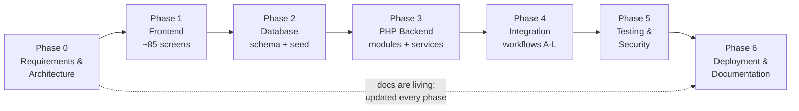

# Development Roadmap

**Status:** Phases 0-3 complete and approved. Phase 4 in progress - stages 4a
(customer), 4b (seller), 4c (delivery) and 4d (support and retention) are
complete; 4c and 4d await approval. Stage 4e not started.
**Last updated:** 2026-09-24

Each phase ends with a **STOP**: a written report and a request for your approval. No phase begins
automatically.

---

## Phase sequence at a glance



---

## A note on the ordering

The brief puts the frontend (Phase 1) before the database (Phase 2). That is not how I would usually
sequence it — building screens before the data model risks designing views that the schema cannot
serve. I am following your ordering, and here is the mitigation that makes it safe:

**Every Phase 1 page will be driven by an explicit view-model array defined in one mock file per
page area** (`app/Views/_mock/*.php`), with the shape it expects documented. Those arrays *are* the
data contract. Phase 2 then designs the schema to satisfy contracts that already exist, and Phase 4
integration becomes "replace the mock provider with a repository call" rather than "rewrite the page".

Every mock file will carry a banner comment:

```php
// ============ MOCK DATA - PHASE 1 ONLY ============
// Replaced in Phase 4 by App\Repositories\ProductRepository::listForCatalog()
// Shape below is the contract the real query must satisfy.
```

Phase 4 is not complete until `app/Views/_mock/` is empty and the directory is deleted. That is a
mechanical, checkable definition of "the mock data is gone".

---

## Phase 0 — Requirements and architecture  *(this phase)*

**Deliverables:** `PROJECT_REQUIREMENTS.md`, `SYSTEM_ARCHITECTURE.md`,
`USER_ROLES_AND_PERMISSIONS.md`, `USER_FLOWS.md`, `DEVELOPMENT_ROADMAP.md`, `DESIGN_SYSTEM.md`,
Mermaid architecture and order-lifecycle diagrams, and the open-questions list.

**Exit criteria:** you approve the docs, or give direction on the open questions **OQ-01 … OQ-10**.

**No code is written in this phase.** The only files created are documentation.

---

## Phase 1 — Frontend

**Goal:** every screen in the inventory, responsive and accessible, running on real PHP templates
with the layout/partial/component system that the backend will later feed.

### 1.0 Project scaffolding (prerequisite work inside Phase 1)

- `git init`, `.gitignore`, `composer.json` with PSR-4 autoloading
- `public/index.php` front controller + `Core\Router` (routes resolve to view-rendering controllers)
- `Core\View` with layouts, partials, components and the `e()` escaping helper
- `.env.example`, `Core\Env`, `Core\Config`
- Tailwind config with `prefix: 'tw-'` and `preflight: false`; design tokens as CSS custom properties
- Apache config: vhost example **and** the root rewrite for `http://localhost/e-commerce/`

### 1.1 Design system foundation

Tokens, typography scale, both canvas tracks, button/card/badge/form/table/nav/empty-state/skeleton
components, plus a live `/styleguide` page that renders every component. The styleguide is how we
review the design system as a whole instead of discovering inconsistency on page 60.

### 1.2 – 1.6 Screens by area

| Sub-phase | Area | Screens |
|---|---|---|
| 1.2 | Public marketplace (cinematic track) | ~23 |
| 1.3 | Customer dashboard (transactional track) | ~14 |
| 1.4 | Seller dashboard | ~17 |
| 1.5 | Delivery + Support dashboards | ~15 |
| 1.6 | Admin dashboard | ~19 |

### 1.7 Frontend behaviour

Vanilla JS modules only: cart quantity controls, filter panel, image gallery, form validation
feedback mirroring the planned server rules, QR scanner hook, status polling stub, toasts, and
progressive disclosure. No dead links, no decorative buttons — anything not yet functional links to a
clearly labelled "planned for Phase N" state rather than `href="#"`.

**Exit criteria**

1. Every screen in the inventory exists and is reachable from real navigation.
2. Verified at 360 / 768 / 1024 / 1440 px with screenshots in the phase report.
3. Loading, empty, success and error states exist for every data-driven screen.
4. Keyboard navigation and focus order pass a manual check; automated contrast check passes.
5. Every mock file carries the banner and a documented shape.
6. `docs/FRONTEND_PAGES.md` lists each page, its purpose, its view-model contract and its states.

**STOP — report and request approval.**

---

## Phase 2 — Database

**Goal:** a normalised schema that imports cleanly into an empty MySQL 8 database and satisfies every
Phase 1 view-model contract.

### Work

- ~34 tables across the 28 required modules (see `DATABASE_DESIGN.md`, produced in this phase)
- Every table: purpose, columns, types, PK, FKs, unique constraints, indexes, relationships
- `DECIMAL(12,2)` money, UTC `DATETIME`, `utf8mb4`, InnoDB, constrained status enumerations
- Parent order + seller sub-order structure (**A-03**)
- Inventory constraints that make overselling impossible at the storage layer
- Unique keys that make duplicate payments and duplicate reminders structurally impossible
- `schema.sql`, `seed.sql`, forward-only `migrations/`, `ER_DIAGRAM.md` with a Mermaid ERD

**Exit criteria**

1. `schema.sql` imports into a clean database with zero errors — evidenced by pasted CLI output.
2. `seed.sql` loads and produces a browsable marketplace with all nine test accounts.
3. Every Phase 1 view-model contract maps to a real query, demonstrated by one sample query per contract.
4. A written concurrency argument for the inventory design, with the test to be executed in Phase 5.
5. Drop-and-reimport is verified, not assumed.

**Outcome (2026-09-22) — all five met, with three deviations from the plan:**

| # | Result |
|---|---|
| 1 | `schema.sql` imports into a dropped-and-recreated database, exit `0`, 44 tables |
| 2 | `seed.sql` imports, exit `0`. **14** accounts, not nine — the extra five cover a suspended customer, a pending seller, a withdrawn consent, a never-consented customer and a failed delivery |
| 3 | 43 contract assertions across 8 areas, all passing, in `tests/Integration/schema_contracts_test.php` |
| 4 | **Executed in Phase 2 rather than deferred to Phase 5.** Signing off an oversell-proof schema on a written argument alone was not good enough. 7/7 assertions pass on two live connections |
| 5 | Drop → schema → seed → both test suites run end to end after this document was written |

Deviations: **44 tables, not ~34** (the estimate predated the payment-intent,
idempotency, consent and zone tables); the **concurrency test was pulled forward** from
Phase 5; and the target server is **MariaDB 10.4**, not MySQL 8 (assumption A-16) — the
schema avoids features exclusive to either.

**STOP — report and request approval.**

---

## Phase 3 — PHP backend

**Goal:** working business logic behind every workflow, callable and testable independently of the UI.

| Sub-phase | Module | Key deliverables |
|---|---|---|
| 3.1 | Core hardening | Session, CSRF, rate limiter, validator, error handling, audit logger |
| 3.2 | Auth | Register, verify, login, logout, reset, RBAC, account status, throttling |
| 3.3 | Catalogue + inventory | Products, images, search, stock, movements, reservations |
| 3.4 | Cart + pricing | Server-authoritative totals, delivery fee rules, merge, validation |
| 3.5 | Orders | `OrderService`, `OrderStateMachine`, history, cancellation, order numbers |
| 3.6 | Pickup | Store selection, hashed collection codes, verification, overdue handling |
| 3.7 | Delivery | Zones, tasks, assignment, statuses, confirmation codes, failures |
| 3.8 | Payments | Gateway interface, sandbox + COD drivers, webhook verification, idempotency, refunds |
| 3.9 | Notifications | Queue, email channel, SMS/WhatsApp stubs, templates, consent, unsubscribe, retries |
| 3.10 | Retention | Consumption estimator, eligibility, scheduler, reorder |
| 3.11 | Support | Tickets, messages, internal notes, scoped lookup, escalation |
| 3.12 | Admin | Approvals, moderation, monitors, settings, reports, audit views |
| 3.13 | CLI | `bin/console.php` and the five scheduled tasks |

**Exit criteria**

1. Every service has at least one unit or integration test that actually runs, with output in the report.
2. The state machines reject every invalid transition in tests, not just in documentation.
3. The webhook handler is proven idempotent by a replay test.
4. The reminder task run twice produces zero duplicates.
5. `docs/BACKEND_MODULES.md` documents each service, its public methods and its failure modes.

**Outcome (2026-09-23) — all five met:**

| # | Result |
|---|---|
| 1 | 513 assertions across 10 suites, all executed, all passing. `php tests/run.php` |
| 2 | 10 invalid transitions asserted to throw, including a customer trying to mark their own order collected and a seller trying to deliver one |
| 3 | The replay returns `already_processed`, writes no second transaction row, and leaves exactly one `paid` charge |
| 4 | `schedule-reminders` run twice: second run schedules 0. The unique key refuses the duplicate insert directly |
| 5 | Written, 496 lines, including where authorisation happens at each layer and the cron/Task Scheduler entries |

**Nine issues were found by these tests and fixed** — listed in the Phase 3
report. The two worth naming here: a collection-code throttle that rolled back
its own counter, so five wrong codes cost nothing; and a search box that
returned a 500 for any query containing a fulltext operator character.

**STOP — report and request approval.** *Approved 2026-09-23.*

---

## Phase 4 — Integration

**Goal:** the frontend runs on the database. Workflows A–L work end to end.

### Work

- Replace every mock provider with repository calls; delete `app/Views/_mock/`
- Wire real forms, CSRF tokens, validation errors and flash messages
- Implement POST-redirect-GET and idempotency keys on every create action
- Verify each of the twelve workflows by executing it and recording the resulting database rows

### Staged, one area at a time

Wiring eighty-five screens in one pass and reporting at the end would mean any
wrong turn in the approach is repeated eighty-five times before anybody sees it.
Each stage ends with a report; the phase ends when the last one is done.

| Stage | Area | Workflows | Status |
|---|---|---|---|
| 4a | Public marketplace, auth, basket, checkout, customer orders | A, D, E, H, part of J | **Complete** |
| 4b | Seller dashboard: products, inventory, order acceptance, ready-for-pickup, collection | B (seller side), C, F, **G** | **Complete** |
| 4c | Delivery: assignment, statuses, confirmation codes, failures | I | **Complete** |
| 4d | Support desk, customer support screens, notifications, preferences, reorder | K, and the rest of J | **Complete** |
| 4e | Admin: approvals, moderation, monitors, settings, reports | B (admin side), L | Not started |

The staging table first put **G** (the customer collects) in 4e. That was wrong:
collection is verified by the seller at their own counter, so it belongs with
the rest of the seller's work and moved to 4b. The admin half of **B** stays in
4e, where the approvals queue lives.

**Exit criteria (the phase, not a stage)**

1. `app/Views/_mock/` no longer exists.
2. Each workflow A–L has a walkthrough in the report with the database state it produced.
3. Duplicate submission is demonstrated to produce exactly one order.
4. Errors degrade gracefully — nothing shows a stack trace or a blank page.

### Stage 4a outcome (2026-09-23)

The customer can now register, confirm an email address, sign in, browse a
catalogue read from the database, fill a basket, check out and see the order
that produced — with nothing mocked anywhere on that path.

| # (stage scope) | Result |
|---|---|
| 1 | The public site and the customer order screens use no mock provider. `app/Views/_mock/` still exists for the four dashboards 4b–4e will wire |
| 2 | Workflows A, D, E and H walked through end to end, with the resulting rows in the stage report |
| 3 | **Met.** A double-submitted checkout produces exactly one order — asserted, not argued |
| 4 | 404, 405 and 403 verified as real responses; no stack trace and no blank page |

**62 new assertions** in `tests/Http/customer_journey_test.php`, driving the real
router, middleware, CSRF check and database through an in-process HTTP client.
Suite total **576 across 11 suites, all passing**, and stable across repeated
runs — the suite restores the seed it touches, including releasing reserved
stock and clearing the failed-login rows its own wrong-password test creates.

**Four defects were found and fixed**, three of them in Phase 3 code that the
Phase 3 tests had passed:

| Where | What |
|---|---|
| `NotificationRepository` | The plaintext collection code was left in `notifications.payload_json` indefinitely. Only the hash was supposed to survive; anything able to read that table could read the code. Now scrubbed on delivery |
| `CartService` | A basket line added without a store was unorderable, and checkout refused it three screens later. It now gets a source store when the customer does not pick one |
| `schema_contracts_test` | An index assertion tested the optimiser's *choice* on a ten-row table, not the schema. It flipped whenever the row mix changed |
| `catalog_test` | The "an unpublished product is unreachable" assertion looked for a draft row the seed does not contain, and skipped silently when there was none — on exactly the rule the public catalogue depends on. It now makes its own |

Also wired, because the footer already promised it: the **one-click unsubscribe
link**, which works with no session at all. The token in the link is the
identity, it is single-use, and withdrawing marketing leaves order updates
switched on — silencing "your order is ready to collect" would be a worse
failure than the mail somebody was trying to escape.

One correction to a Phase 1 assumption: the checkout draft offered a delivery
address **per seller**. The schema is explicit that there is one recipient and
one address per order, so the page now asks once.

### Stage 4b outcome (2026-09-23)

A seller can now sign in, work an order from arrival to handover, list a product
and stock it — all on the database, all scoped to their own rows.

| What | Result |
|---|---|
| Workflow F | accept → prepare → ready, each step through `OrderStateMachine`; the five transitions and their actors asserted in order |
| Workflow G | "ready" issues a hashed collection code in the same transaction; a wrong code costs an attempt; the right one completes the order and takes the units off the shelf |
| Workflow C | create → validate → stock → publish, with publishing refused until a store actually holds stock |
| Workflow B | the applicant's side: an unapproved seller reaches their dashboard and is refused at the point of publishing, by `sellers.status` rather than by a hidden button |
| Isolation | another seller's order is a 404, their product cannot be renamed or restocked, and their edit form is a 404 |
| Disclosure | the seller sees "Asha M." and a masked number, never the email or the full number, and never the collection code |

**72 new assertions** in `tests/Http/seller_workflow_test.php`. Suite total
**649 across 12 suites, all passing**, and now genuinely idempotent — three
consecutive full runs leave every row count, every stock figure and the
append-only movement ledger exactly where they started.

**Six defects found and fixed**, four of them in code that Phase 3's tests had
passed:

| Where | What |
|---|---|
| `CheckoutService` | **A cash order never reached a seller.** It was created at `pending_payment` waiting for a gateway callback that, for cash, never comes — and cash orders have no expiry, so it would have waited for ever. Cash now goes straight to the seller, through `OrderService::transition` like every other status change |
| `PaymentService` | **An order could be paid twice.** The unique key stops the same reference being replayed; it does not stop a second, different reference settling an order that is already paid. Two callbacks captured twice the money. Now refused, recorded and audited |
| `OrderStateMachine` | An invalid transition threw `RuntimeException`, which the web layer treats as a fault — so pressing a stale button gave a **500 instead of an explanation**. It now throws `DomainRuleException`, which extends it, so every existing `catch` still works |
| Checkout (4a) | **No card order ever reached a seller either**, because nothing started the payment. There is now a webhook endpoint and, while the sandbox driver is configured, a stand-in that signs a real payload and posts it to that endpoint |
| `catalog_test` | An assertion inside a loop made the suite's total depend on how much stock happened to exist, so a changing count meant nothing |
| Both HTTP suites | The teardown underflowed an `UNSIGNED` column and reused a named placeholder, so cleanup died silently and every run leaked orders, products and ledger rows |

Also added, because Phase 3 built the read and stock sides of the catalogue but
not the write side: **`ProductService`** — the only thing permitted to write to
`products`, and the layer that enforces ownership, the right to trade, and
"publishing needs stock somewhere".

### Cash on fulfilment: the risk controls

Reviewing the cash fix raised a question the fix did not answer: cash orders
reached sellers with **no commitment from the customer at all**. A verified
account could place any number, each one committing a seller to picking and
holding goods, with no cap and no consequence for never appearing. Every other
method takes the money first; cash is the one where the seller carries the risk.

Added, with `2026_09_23_01_cash_on_fulfilment_controls.sql`:

| Control | Default | Where it lives |
|---|---|---|
| The seller may refuse cash | accepts it | `sellers.accepts_cod`, on their settings page |
| Order value cap | TSh 200,000 | `settings` |
| Open cash orders per customer | 2 | `settings` |
| No-show strikes before cash is withdrawn | 2 in 90 days | `settings` |

`Services\Payment\CashEligibility` is the one place that answers "may this
customer pay cash for this basket". The checkout page renders the verdict as a
reason beside a disabled option; `CheckoutService` checks it again before
creating anything, because the page is a suggestion and the service is the
decision.

What counts as a no-show is deliberately narrow — recipient absent, unreachable,
refused, access denied, and a collection abandoned past its window. A parcel
too heavy for the agent or a flooded road is not the customer's fault and is
never counted.

The payment page is now built from `PaymentService::optionsForCheckout()` rather
than hardcoding three options, so what is offered is what the system will accept.
The four mobile-money providers are listed as unavailable with the reason stated.

**15 further assertions**, total **649 across 12 suites**.

**Not done in 4b:** product image upload. The form now says so plainly instead
of showing a file picker that discards what it is given.

### Stage 4c outcome (2026-09-23)

A delivery agent can now sign in, see their own tasks and nobody else's, collect
a parcel from a store, carry it, and hand it over against a code the recipient
reads out — or record why they could not, until the parcel goes back.

| What | Result |
|---|---|
| Workflow I | assigned → picked up → out for delivery → delivered, each step through the task state machine, with the order following |
| The code | issued when the seller marks ready, stored only as a SHA-256, never rendered on any agent page, and the only thing that completes a delivery |
| Failures | reasoned from an allow-list, counted, logged append-only; out of attempts the parcel returns to the seller and the order goes to `refund_pending` |
| Isolation | another agent's task is a 404, absent from their list, and unchanged by posting its reference to a handler |
| Disclosure | an unaccepted job shows zone, collection point, fee and a size band — no name, no address, because the query does not select them |

**42 new assertions** in `tests/Http/delivery_workflow_test.php`. Suite total
**691 across 13 suites, all passing**, idempotent across three consecutive runs.

**Five defects found and fixed**, four of them in code earlier stages had
shipped:

| Where | What |
|---|---|
| `SellerController` (4b) | **A delivery order was marked ready without issuing its code.** `DeliveryService::markReadyForDispatch` exists and does both; the seller controller called plain `markReady`, so the parcel could never be handed over. The same mistake I had avoided on pickup |
| `CheckoutService` | **`delivery_tasks.cod_amount` was never set.** The column exists so the agent knows what to collect at the door; it was always NULL, so a cash delivery told the agent nothing |
| `OrderRepository::markPaid` | **A cash order could never be marked paid** — the guard allowed `pending`/`processing` only, and cash is `pending_cod` |
| `PaymentService` | **Nothing ever settled a cash order.** The money changed hands at a counter or a door and no transaction was written; every figure built on `payment_status` was wrong by exactly the cash takings. New `settleCashOnHandover()`, called from both handover points, writing one transaction per sub-order and marking the parent paid only once nothing is outstanding |
| `CashEligibility` (this session) | `refund_pending` counted as an open cash order for ever, quietly locking somebody out of cash for days over one failed delivery |

One disclosure fix at source: `DeliveryRepository::availableForAgent()` was
selecting `recipient_name`, `recipient_phone`, `address_line` and `landmark` for
jobs the agent had **not** accepted. The template did not print them, but a
later change easily could. It no longer fetches them.

Also cleaned: the HTTP suites were leaving queued notifications behind. Sixty-
eight orphaned rows had accumulated at the front of the sending queue and pushed
an unrelated retention test's own messages out of its batch — a teardown
breaking a suite it never touches.

**STOP — report and request approval.**

---

### Stage 4d outcome (2026-09-24)

Support is now a desk rather than a screenshot, and the retention engine has a
customer-facing half. A customer opens a request, reads the thread, replies and
reopens it; an agent picks it up, notes things the customer must never see,
escalates it or closes it with a summary the customer reads.

| What | Result |
|---|---|
| Workflow K | open → assigned → replied → waiting on customer → reopened by a reply → escalated with a reason → resolved with a summary, all through real handlers |
| Internal notes | excluded from the customer thread **in SQL** (`is_internal = 0` in the WHERE clause). The assertion reads the returned rows, not the page, so a template that happened to hide one still fails |
| Order lookup | support is not scoped to a subset of orders — a desk that can only see some orders cannot answer the phone — so the control is the trail: every open is audited with the agent, the order, the time and the ticket that justified it, **including an open that found nothing** |
| The justification | collected beside the search and carried into each result link, so opening one is a single click that is still audited against a stated reason |
| Collection codes | support can cause a new one to be sent and cannot read either the old one or the new one. The plaintext goes to the customer's own channel and appears on no page an agent can open |
| Preferences | optional and non-optional categories are decided by a rule in the service, not a flag in the template. A crafted POST asking to switch off order updates is ignored, not obeyed |
| Consent | follows the toggles: switching every optional category off withdraws marketing consent, so the record cannot contradict the settings. Still append-only |
| Unsubscribe | cancels queued marketing that has not gone out, so "takes effect immediately" is true rather than true next batch |
| Reorder | every line re-priced and re-checked; the quantity shown is what pressing Add would actually put in the basket. Nothing substituted, ever |
| The contact form | opens a real ticket. It needs an account, which is a decision rather than an oversight: a ticket is a thread with a status somebody comes back and reads, and a reply has to have somewhere to go. A signed-out visitor is shown the way in and comes back |

**79 new assertions** in `tests/Http/support_workflow_test.php`, plus 6 in
`tests/Unit/core_test.php`. Suite total **779 across 14 suites, all passing**,
idempotent across three consecutive runs from a fresh import, and verified over
real HTTP for all five roles.

#### The defect that mattered

**Logging in did not work outside the test kernel.** Every role, every browser,
since the auth work in Phase 3 — and nothing in any log.

`ThrottleMiddleware` built its bucket key as `auth.login.submit|POST` and
`RateLimiter::hitSession()` put it in the session. PHP's default session
serializer uses `|` as its own delimiter and cannot represent a key containing
one, so it **silently discarded the entire session** rather than that one entry.
No warning, no exception, no error. The login wrote `_auth_user_id` into a
session that was then thrown away, so signing in appeared to work — the redirect
was right, the flash was right — and the next page asked you to sign in again.

It survived this long because it only affects requests that pass through the
throttle middleware, which are almost exactly the requests that sign you in, and
because the in-process test kernel drives the router, middleware, controllers
and database but not PHP's own session serializer. 691 assertions were green
over a login that did not work.

Fixed at the source in `RateLimiter::bucketKey()` — no caller can reintroduce it
— and at the one call site that got it wrong. `tests/Unit/core_test.php` now
asserts the property against PHP's real behaviour via a subprocess fixture, so
if a future version changes this the tests say so.

Two smaller things came out of chasing it: `Session::commit()` now writes and
unlocks the session before the response body goes out rather than at shutdown,
so two requests from one browser stop queueing behind each other; and the
schema-contract suite no longer asserts which plan the optimiser picks on a
four-row table, which is a cost-model question that changed with whatever a
previous suite left behind.

#### Other defects found and fixed

| Where | What |
|---|---|
| `SupportService::assign` / `escalate` | **Assigning a ticket already assigned to you reported "that ticket could not be found."** MySQL returns zero *changed* rows when the values match, which is not zero *matched* rows. Existence is now a read; the write is allowed to be a no-op |
| `Router::url()` | **Parameters with no matching placeholder were silently dropped.** The support lookup link looked right and had lost the ticket reference that justified it. They become a query string now |
| `ReorderService` | **Availability was summed across every store**, but a basket line draws from one counter — so the page promised a quantity no single line could take and the refusal arrived after the button was pressed |
| `ReorderService` | **What was already in the basket was ignored.** Adding to an existing line increases it, so the second press was refused over a total the customer never asked for, naming a number they could not see. The page now shows room, not stock |
| `SupportController` | Opening an order from a ticket required typing a reason the agent was currently looking at. The ticket's links carry it |
| `customer/preferences` | Quiet hours were two dropdowns that saved nothing — there is no per-customer column and the window is platform-wide. It states the real window instead, which is what the rest of that page promises |
| `SupportService::lookUpOrder` | Took a parent order number but the page it feeds is a sub-order view. Now takes the part, which is what an agent is actually looking at when an order is split between two sellers |

#### Not done in this stage

The customer account tail — profile, addresses, payments and reviews — still
renders sample data and still says so. It is account management rather than
support or retention, and folding it in here would have made this stage two
stages wearing one name. It is the first thing in 4e or a stage of its own,
whichever you prefer.

**STOP — report and request approval.**

---

## Phase 5 — Testing, security and QA

| Area | Work |
|---|---|
| Functional | Test cases per FR id; executed results recorded pass/fail/pending |
| Security | SQLi, XSS, CSRF, access control, session, upload, exposure, payment verification, duplicate payment, IDOR, race conditions |
| Concurrency | Scripted parallel checkout for the last unit of stock |
| Regression | Re-run after every fix |
| Accessibility | Keyboard, contrast, labels, focus, live regions |
| Responsive | 360 / 768 / 1024 / 1440 px on every page |

**Deliverables:** `TEST_PLAN.md`, `SECURITY_REVIEW.md`, `TEST_RESULTS.md`, `tests/`.

**Exit criteria:** every test is marked **executed-pass**, **executed-fail (fixed, re-run)** or
**pending**, with no category left unexamined. Failures are fixed before the phase is declared
complete. No production-readiness claim is made without the evidence to back it.

**STOP — report and request approval.**

---

## Phase 6 — Local deployment and documentation

`README.md`, `docs/INSTALLATION.md`, `docs/CONFIGURATION.md`, `docs/CRON_SETUP.md` (Windows Task
Scheduler **and** Linux cron), `docs/TROUBLESHOOTING.md`, `docs/BACKUP_RESTORE.md`,
`docs/PRODUCTION_CHECKLIST.md`, `docs/TEST_ACCOUNTS.md`, `.env.example`.

**Exit criteria:** a clean-machine install following only the written instructions produces a working
system — performed and recorded, not assumed.

---

## Cross-phase practices

| Practice | Applied from |
|---|---|
| Conventional commits referencing FR ids | Phase 1 |
| Docs updated in the same change as the code | Phase 1 |
| No secret ever committed; `.env` git-ignored from the first commit | Phase 1 |
| Every phase report states what was executed vs what is pending | Phase 0 |
| Requirements traceability: FR id → code → test | Phase 3 |

---

## Risk register

| Risk | Impact | Mitigation |
|---|---|---|
| Frontend-before-database ordering causes rework | Medium | View-model contracts as the interface (see the note above) |
| Scope is large for a no-framework build | High | Must/Should priorities; Should items deferred with your agreement rather than silently dropped |
| Bootstrap and Tailwind conflict | Medium | `tw-` prefix, `preflight: false`, per-component ownership, styleguide page |
| Concurrency bug reaches Phase 5 undetected | High | Concurrency test written in Phase 3, executed in Phase 5 |
| No live payment provider | Certain | Sandbox driver labelled as such everywhere; integration guide for later |
| Windows/XAMPP environment quirks | Medium | Documented setup; both serving modes supported; no symlinks |
| Reminder engine perceived as spam | Medium | Consent, cooldown, frequency cap, quiet hours, structural dedupe, one-click opt-out |

---

## What I need from you to start Phase 1

1. Approval of these Phase 0 documents.
2. Answers to any of **OQ-01 … OQ-10** you want decided differently from the stated defaults —
   particularly **OQ-06** (is the black cinematic public site the direction you want?),
   **OQ-07** (is a one-time Node build step acceptable for Tailwind?) and **OQ-08** (Composer for
   PHPMailer and PHPUnit).
3. Confirmation that I should build all ~85 screens in Phase 1, or a reduced set to review the design
   direction first. My recommendation: **build sub-phases 1.0–1.2 first** (scaffolding, design system,
   styleguide and the public marketplace), let you react to the look and feel, then continue through
   1.3–1.6. Redesigning 85 screens after the fact is the expensive path.
