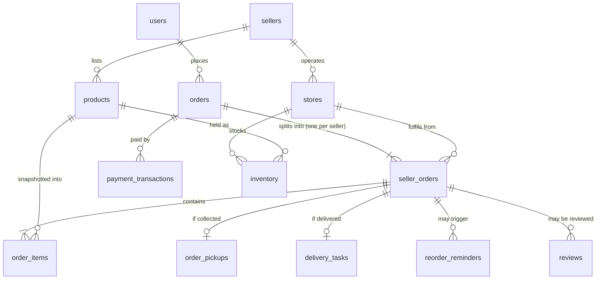
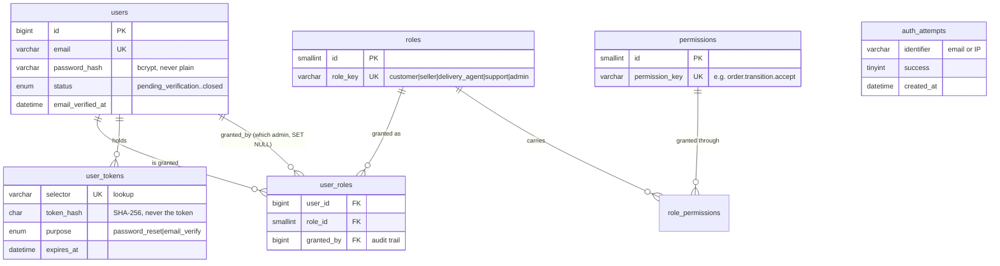
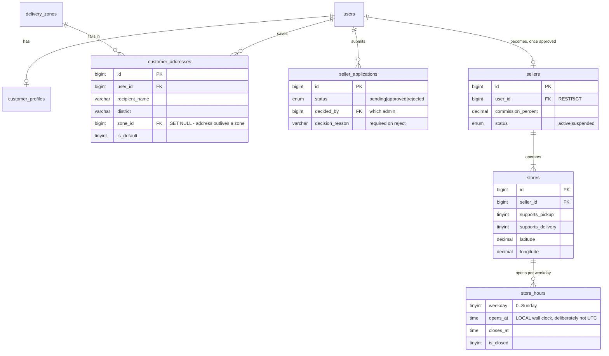
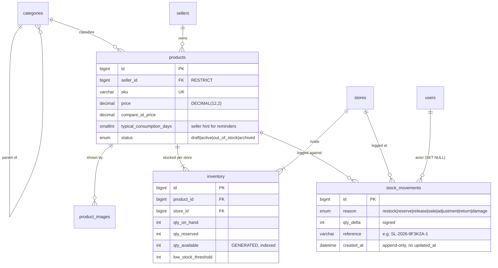
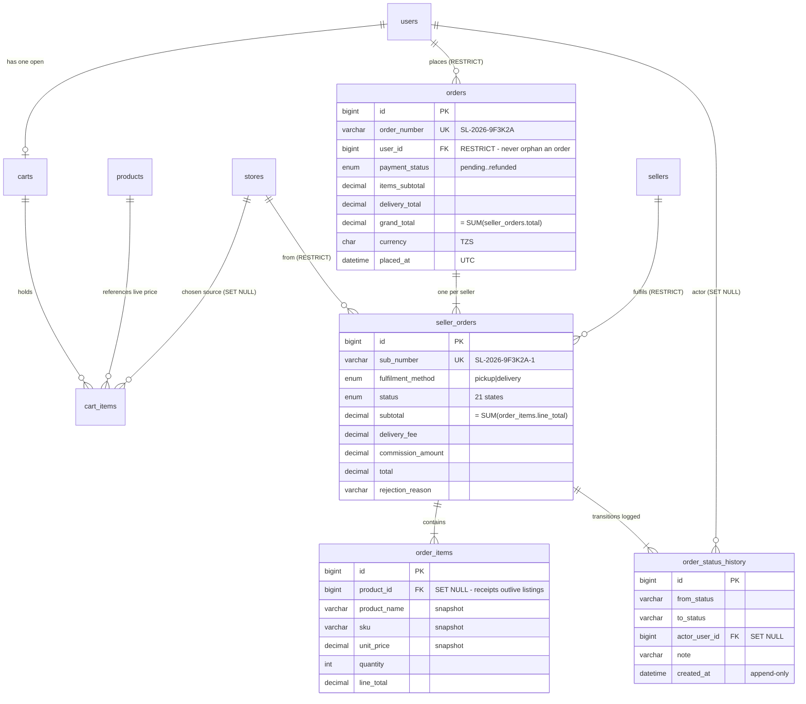
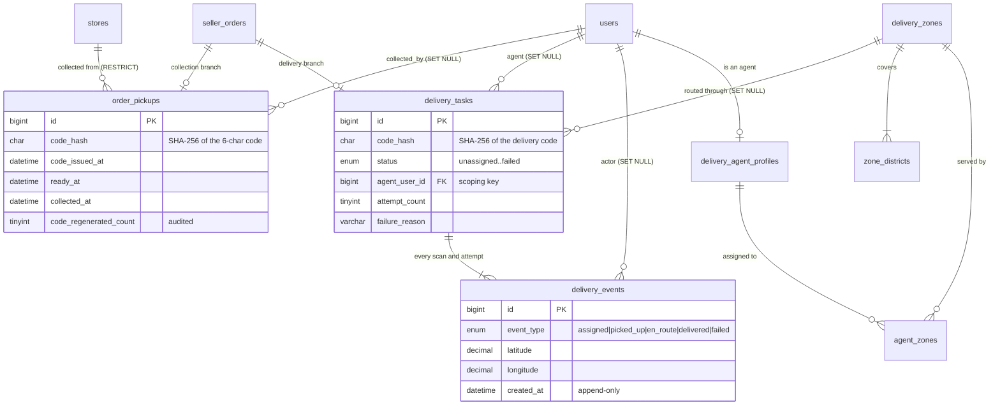
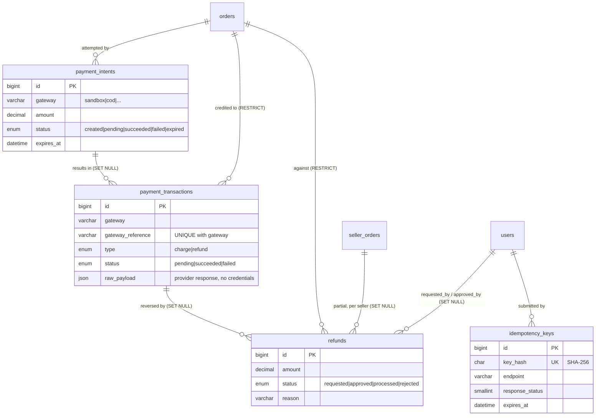
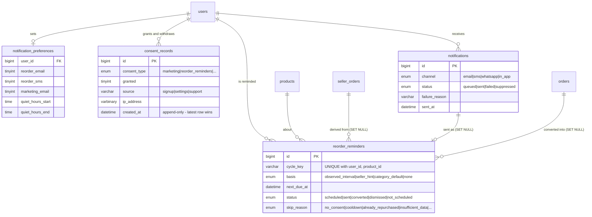
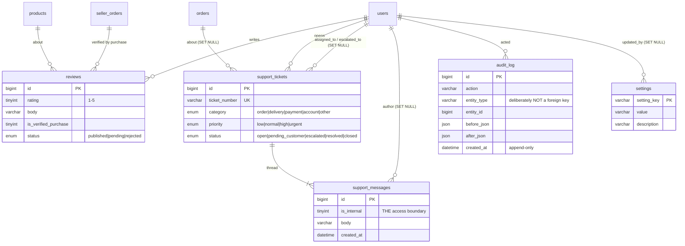

# Entity Relationship Diagrams

**Generated from the live `sokolink` schema on 2026-09-22.** 44 tables, 75 foreign keys.
Column-level detail is in [DATABASE_DESIGN.md](DATABASE_DESIGN.md) §12.

A single 44-table diagram is unreadable, so this document gives **one overview of the spine** and
then **eight domain diagrams**. Every foreign key in the database appears in exactly one domain
diagram; tables that bridge two domains are drawn in both, with the second appearance marked.

Reading the notation:

| Symbol | Meaning |
|---|---|
| `||--o{` | one to many, the many side optional (zero or more) |
| `||--|{` | one to many, at least one required |
| `||--||` | one to one |
| `}o--||` | many to one, optional on the many side |

---

## 1. The spine

The path a purchase actually travels. Everything else hangs off this.



Two things to read off this diagram:

1. **`orders` has no status of its own beyond payment.** Fulfilment status lives on
   `seller_orders`, because one basket can be half collected and half in transit.
2. **`order_items` points at `products` with `ON DELETE SET NULL`.** Line items carry their own
   name, SKU and price, captured at the moment of sale. Delisting a product must never rewrite a
   receipt that has already been issued.

---

## 2. Identity and access control



**A user can hold several roles** — `user_roles` is a junction, not a column on `users`. A shop
owner who also buys things is one account with two roles, not two accounts. `auth_attempts` has no
foreign key on purpose: failed logins for addresses that do not exist are exactly the ones worth
rate-limiting.

Permissions are **never** checked by role name in application code. The check is
`user → user_roles → role_permissions → permissions`, so changing what a role can do is data, not
a deploy.

---

## 3. Customer profile, sellers and stores



`seller_applications` is kept **after** approval rather than discarded. It is the record of why an
account was granted selling rights and by whom — an audit question that gets asked precisely when
something has gone wrong.

`stores.supports_pickup` / `supports_delivery` are what drive the checkout: a store that does not
offer collection never appears in the pickup picker. That is a data-level rule, not a UI filter.

---

## 4. Catalogue and inventory



`inventory` is **unique on `(product_id, store_id)`**. There is no single stock number for a
product: the same cooking oil can be available in Kariakoo and gone in Mbezi, and the checkout must
know the difference.

`qty_available` is a **generated column**, `qty_on_hand - qty_reserved`, and it is indexed. Two
stored numbers that must agree eventually will not; a derived one cannot disagree.

`CHECK (qty_reserved <= qty_on_hand)` is the last line of defence under the row lock and the
guarded `UPDATE`. All three are exercised by `tests/Concurrency/oversell_test.php`.

`stock_movements` is append-only. Every change carries a reason, an actor and a reference, so
"where did twelve units go?" has an answer. Corrections are new rows, never edits.

---

## 5. Cart and the two-level order



`cart_items` deliberately stores **no price**. A cart is an intention, not a contract; the price is
read live at checkout and only then snapshotted into `order_items`. This is also why the brief's
rule "never trust prices submitted by the client" is structurally easy to honour — there is nowhere
for a client-supplied price to be stored in the first place.

`orders.user_id` is `RESTRICT`: closing an account must not delete financial history. Account
closure sets `users.status = 'closed'` and anonymises the profile; the orders stay.

---

## 6. Fulfilment — collection and delivery



**Neither code is stored in readable form.** `order_pickups.code_hash` and
`delivery_tasks.code_hash` hold SHA-256. Nobody — seller, support agent or administrator — can read
a collection code back out of the database; they can only verify a code the customer presents, or
regenerate one, and regeneration is counted and audited. That is what makes "do not allow arbitrary
users to mark orders as collected" enforceable rather than aspirational.

`delivery_tasks.agent_user_id` is the **scoping key** for the whole delivery role. The index
`idx_task_agent_status` makes `WHERE agent_user_id = :actor` an indexed lookup (`EXPLAIN` shows
`type=ref`), so the access boundary costs nothing and there is no temptation to skip it.

---

## 7. Payments and refunds



Two constraints carry the whole integrity story here, and both are in the schema rather than in a
service class:

- **`UNIQUE (gateway, gateway_reference)` on `payment_transactions`.** A gateway that retries a
  webhook — which every gateway does — cannot credit an order twice. The second insert is rejected
  by the database, not by a code path somebody might refactor. The contract test performs exactly
  that replay and asserts the rejection.
- **`UNIQUE (key_hash)` on `idempotency_keys`.** A double-clicked checkout produces one order. The
  stored `response_status` lets the replay return the original answer rather than an error.

**No table in this domain can hold a payment credential.** There is no column for a card number,
CVV, PIN or mobile-money PIN anywhere in the schema, and the contract test asserts that by scanning
`information_schema` for column names matching those patterns — the count must be zero. What is
stored is the gateway's own reference and its response payload.

`payment_transactions.order_id` is `RESTRICT`. Money records are never removed by a cascade.

---

## 8. Consent, notifications and the retention engine



This is where the brief's two hardest retention rules become structure rather than intention.

**"Do not assume a customer has run out merely because days have passed."** `basis` records how
`next_due_at` was derived, and the priority order is strict: the customer's own observed median
repeat interval beats a seller's hint, which beats a category default. When none of those is
available, `basis = 'none'`, `status = 'not_scheduled'` and `skip_reason = 'insufficient_data'` —
and **nothing is sent**. The seed contains such a product (Karatasi Kitchen Roll) precisely so that
silence is a tested outcome rather than an untested branch.

**"Do not message people who have not agreed."** `consent_records` is append-only and the current
state is the newest row, so withdrawal is a new row rather than an edit. The seed carries all three
cases — consented, never consented, consented then withdrew — and the contract test asserts the
engine reaches `eligible`, `no_consent` and `consent_withdrawn` respectively.

`UNIQUE (user_id, product_id, cycle_key)` means running the scheduler twice inserts nothing the
second time. Duplicate reminders are impossible by construction, not by a flag somebody has to
remember to check.

Note also `notifications.status = 'suppressed'` with a `failure_reason`: a message that was
deliberately not sent is recorded as such. The brief forbids pretending messages go out through
providers that are not connected, and a suppressed row with a stated reason is how that stays
honest in Phase 3.

---

## 9. Reviews, support and platform



`reviews` carries `UNIQUE (user_id, product_id, seller_order_id)` and requires a `seller_order_id`
whose status reached a terminal fulfilled state — a review is tied to a purchase that actually
happened.

**`support_messages.is_internal` is the most easily-botched boundary in the system.** The customer
query excludes internal rows **in SQL**:

```sql
SELECT ... FROM support_messages
 WHERE ticket_id = :id AND is_internal = 0
 ORDER BY created_at;
```

They are never fetched and then hidden in a template, because a template-level hide is one
refactor away from a leak. The index `idx_msgs_ticket_internal_time` covers the clause. The
contract test asserts support sees 3 messages on the seed's ticket 2 and the customer query returns
2.

`audit_log.entity_type` / `entity_id` are intentionally **not** a foreign key. The log must survive
the deletion of the thing it describes — that is the entire point of a log. It has no `updated_at`
and no application delete path, including for administrators. An audit trail that privileged users
can rewrite is not evidence of anything.

---

## 10. ON DELETE policy

Every one of the 75 foreign keys falls into one of three groups, and the group is chosen by asking
what the row *means*, not by what is convenient.

| Rule | Used for | Examples |
|---|---|---|
| `RESTRICT` | Anything financial or contractual. The parent cannot be deleted while the child exists. | `orders.user_id`, `payment_transactions.order_id`, `refunds.order_id`, `seller_orders.seller_id`, `products.seller_id`, `stores.seller_id`, `order_pickups.store_id` |
| `CASCADE` | Detail rows that have no meaning without their parent. | `order_items.seller_order_id`, `cart_items.cart_id`, `product_images.product_id`, `inventory.product_id`, `store_hours.store_id`, `support_messages.ticket_id`, `delivery_events.task_id` |
| `SET NULL` | History that must outlive the thing it refers to. | `order_items.product_id`, `delivery_tasks.agent_user_id`, `order_status_history.actor_user_id`, `support_tickets.order_id`, `stock_movements.actor_user_id`, `settings.updated_by` |

The `SET NULL` group is the one worth reading twice. When a staff member leaves and their account
is removed, the transitions they performed must still be in `order_status_history` — the actor
becomes unknown, the event does not disappear. Likewise a delisted product leaves `order_items`
intact, because the line item already carries its own name, SKU and price.

Account closure is therefore **not** a row deletion. `users.status` becomes `closed`, the profile
is anonymised, and the `RESTRICT` rules guarantee the financial record survives.

---

## 11. How this diagram was produced

The relationships above were read out of `information_schema.KEY_COLUMN_USAGE` and
`REFERENTIAL_CONSTRAINTS` on the live `sokolink` database after importing `database/schema.sql`,
so they describe what exists rather than what was intended. To regenerate the underlying list:

```sql
SELECT k.TABLE_NAME, k.COLUMN_NAME, k.REFERENCED_TABLE_NAME, r.DELETE_RULE
  FROM information_schema.KEY_COLUMN_USAGE k
  JOIN information_schema.REFERENTIAL_CONSTRAINTS r
    ON r.CONSTRAINT_NAME = k.CONSTRAINT_NAME
   AND r.CONSTRAINT_SCHEMA = k.TABLE_SCHEMA
 WHERE k.TABLE_SCHEMA = 'sokolink'
   AND k.REFERENCED_TABLE_NAME IS NOT NULL
 ORDER BY k.TABLE_NAME, k.COLUMN_NAME;
```

Mermaid renders on GitHub and in VS Code with the Markdown Preview Mermaid extension. If you are
reading this in a plain viewer, the code blocks are the diagrams.
