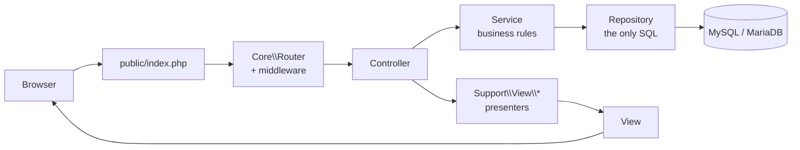

# Integration — how a screen reaches the database

**Status:** Phase 4, stages 4a (customer), 4b (seller), 4c (delivery) and 4d
(support and retention) complete. 4e pending.
**Last updated:** 2026-09-24

Phase 1 built the screens against mock data. Phase 3 built the services against
the database. This document is the seam: how a form becomes a service call, and
how a query becomes a page.

---

## 1. The path a request takes



Two rules make this readable, and both are enforced by where the code lives
rather than by convention:

- **Repositories are the only layer that writes SQL.** "Can anything read
  another seller's orders?" is answerable by reading one folder.
- **Views never touch a repository.** A controller calls a service, hands the
  result to a presenter, and passes an array to a template.

---

## 2. Presenters: why they exist

A query says `business_name`, `available` and `rating_avg`, because those are
the column names. A product card says `seller_name`, `qty_available` and
`rating`, because those are what a card shows. Neither vocabulary is wrong.

Phase 1 documented a view-model contract per page area in `app/Views/_mock/*.php`
on the promise that Phase 4 would **satisfy** those contracts rather than rewrite
eighty templates. `app/Support/View/` is where that promise is kept.

| Class | Turns | Into |
|---|---|---|
| `Present` | product, store, review, category rows | the card and page contracts |
| `CartView` | `CartService::summary()` | the basket page, incl. the collection-point picker |
| `OrderView` | an order + its sub-orders | the confirmation page |
| `SubOrderView` | one seller sub-order | the customer's and seller's order list and detail |
| `TaskView` | a delivery task | the agent's screens, and an offer with far less on it |
| `TicketView` | a support ticket and its messages | the queue, the staff thread, and the customer's own thread |
| `Chrome` | categories, basket count | the navigation bar, on every page |

`Present` is pure: rows in, arrays out, no database, no HTML, no money
formatting. `CartView` is allowed a repository because working out which stores
can supply a whole seller group needs per-store stock. `Chrome` memoises per
request and swallows a database failure, because navigation is chrome — if the
database is down, the page explaining that should still render.

---

## 3. The write path

Every POST handler has the same shape, stated once in `Controllers\Controller`:

1. Read input from the request.
2. Call a service inside `attempt()`.
3. On success: flash a message, **redirect** (303).
4. On failure: flash the error, keep what was typed, redirect back.

`attempt()` turns the two expected failures into something a user can act on:

| Exception | Means | Becomes |
|---|---|---|
| `ValidationException` | you typed it wrong | per-field messages beside each field, form repopulated |
| `DomainRuleException` | that is not allowed | one flash message |
| anything else | a fault | logged with a reference, generic error page |

Step 3 is POST-redirect-GET, and it is why refreshing after placing an order
re-displays the confirmation rather than resubmitting the form.

### Old input and errors

A failed POST redirects, so what was typed has to survive exactly one redirect
and then disappear. `Session::flashInput()` and `flashErrors()` write it;
`Application::boot()` calls `Session::hydrateOldInput()` to pull it straight
back out again, before any template can ask. Pulling at boot rather than on
first read is what stops a stale error surfacing on an unrelated page later.
Passwords and the CSRF token are stripped before anything is written.

### CSRF

Applied to **every** POST by the router itself, not listed per route:

```php
if ($route['method'] === 'POST' && !in_array('csrf', $middleware, true)) {
    array_unshift($middleware, 'csrf');
}
```

Opt-in CSRF protection is protection that will eventually be forgotten on the
one route where it mattered. A POST without a valid token is a 403.

### Idempotency

`/checkout/place` carries a key minted when the payment page was rendered and
held in the session. A double-clicked button, a refreshed POST and a browser
retry all replay the same key; `CheckoutService` returns the order it already
made. The key is cleared when the order is placed, so a genuinely new checkout
gets a new one.

---

## 4. What is wired, and what is not

| Area | State |
|---|---|
| Public marketplace — home, catalogue, category, product, store, search | **Database** |
| Basket — add, update, remove, choose collection point | **Database** |
| Checkout — fulfilment, payment, place, confirmation | **Database** |
| Auth — register, verify, login, logout, forgot, reset | **Database** |
| Unsubscribe — one-click, no session required | **Database** |
| Customer — overview, orders, history, order detail | **Database** |
| Payments — webhook endpoint, and the sandbox stand-in | **Database** |
| Seller — dashboard, orders, order detail, pickup, verify, dispatch, products, product form, inventory, stores, reviews | **Database** |
| Customer — support requests, thread, reply, reopen | **Database** |
| Customer — notifications, preferences, consent, unsubscribe, reorder | **Database** |
| Customer — profile, addresses, reviews, payments | Sample data, banner on the page |
| Seller — settings, “order handling” panel only (prep time, auto-accept, low-stock, cash on/off) | **Database** |
| Seller — reminders, reports, store edit, the rest of settings | Sample data, banner on the page |
| Delivery — dashboard, tasks, task detail, offers, history, failure report | **Database** |
| Support — overview, ticket queue, ticket thread, escalations, order lookup, message log | **Database** |
| Contact form — opens a real ticket, for a signed-in customer | **Database** |
| Admin dashboard | Sample data, banner on the page, routes still open |

Every screen still on sample data says so on the screen. The list of wired
screens lives in one constant per area — `CustomerController::WIRED`,
`SellerController::WIRED`, `SupportController::WIRED` — so "is this screen real?" has one answer in one
place and a forgotten banner cannot make an unwired screen look finished.

Product image upload is not built. The product form says so, rather than
showing a file picker that discards what it is given.

`app/Views/_mock/` and `app/Support/Mock*.php` are deleted when the last of
those rows says "Database". That is the mechanical definition of Phase 4 being
complete, and it has not been met yet.

---

## 5. Access control

Two things, and the second is the one that counts.

**The route gate** answers "should this person see this area at all?"

```php
Router::group(['middleware' => ['auth', 'role:customer']], function (): void {
    Router::get('/customer/orders', [CustomerController::class, 'orders'], 'customer.orders');
});
```

**The query scope** answers "is this row theirs?", and it is in the WHERE clause:

```sql
WHERE so.sub_number = :ref AND o.user_id = :user
```

Rows another customer owns are never fetched and then hidden — they are never
selected. A request for somebody else's order reference returns `null`, and the
controller gives the same 404 it gives for a reference that does not exist:
"not yours" and "no such order" must be indistinguishable, or the difference
between them is an oracle for guessing valid references.

Checkout carries `verified` as well as `auth`. The middleware gives an
unverified customer a useful page instead of an exception; `CheckoutService`
refuses the order regardless, which is the check that actually stops it.

### A third thing, for sellers: the role is not the permission

`role:seller` gets an applicant as far as their dashboard, and that is
deliberate — somebody waiting on a decision should be able to see the account
they applied for and start building a catalogue. What they cannot do is trade,
and no route gate can express that distinction.

`sellers.status = 'active'` can, and every service that matters checks it:

```php
if (!$this->sellers->canTrade($sellerId)) {
    throw new DomainRuleException('Your seller account is not approved for trading yet. ...');
}
```

The page shows the state rather than hiding the button, because a control that
vanishes teaches nobody why.

### A fourth thing, for support: there is no WHERE clause

Every other area is scoped by ownership. Support is not, and cannot be: a desk
that can only see its own customers' orders cannot answer the phone. The person
calling has a problem with an order, and the agent has to be able to open it.

So the control is a different one — the trail:

```php
// SupportService::lookUpOrder()
Audit::sensitive('support.order.viewed', 'seller_order', $subNumber, $justification, ...);

$row = $this->support->subOrderForSupport($subNumber);
```

Three properties, in order of how easily each is lost:

1. **The justification is a required parameter, not an optional note.** A
   service that accepts `''` and hopes somebody fills it in has an access policy
   somebody remembers to follow, which is not an access policy.
2. **The audit row is written before the read**, and outside any transaction the
   caller may be in. A lookup that then fails, or that finds nothing, is still
   recorded — otherwise "it errored" is a way to look at a record without
   leaving a trace.
3. **The reason is carried, not retyped.** The links on a ticket already include
   that ticket's reference, and the order search asks for one beside the query
   rather than after the agent has seen the result. A reason somebody has to
   type about a record they are already looking at is a reason that becomes
   "checking" within a week.

What support still cannot do is read a collection code. They can cause a new one
to be issued — `PickupService::regenerateCodeForSupport()` — and the plaintext
goes to the customer's own notification channel. It is on no page an agent can
open, because an agent who can read a collection code can collect an order.

### Internal notes: the filter is in SQL, and that is the whole control

A support thread has two audiences and they see different rows. The difference
is made by the query, not by the template:

```sql
-- SupportRepository::customerMessages()
WHERE m.ticket_id = :ticket AND t.user_id = :user AND m.is_internal = 0
```

A template-level hide is one careless refactor, one JSON endpoint or one "export
this thread" feature away from showing a customer what staff wrote about them.
A WHERE clause is not. `TicketView::customer()` filters again on the way past,
but that is belt as well as braces — if an internal row ever reaches it, that is
already a bug.

The test asserts this against the returned **rows**, not the rendered page, so a
template that happened to hide a note would still fail.

---

## 6. Things the browser is not trusted with

| Posted | What happens |
|---|---|
| a price, a line total, a grand total | ignored; every amount is recomputed by `PricingService` from the product rows |
| a delivery fee | ignored; resolved from the address's zone, server-side |
| a role | never read from the request; roles come from the session user |
| another customer's `cart_item_id` | the update and delete are scoped by cart, so it does nothing |
| another customer's `address_id` | `findOwned()` returns null and the checkout refuses |
| a fulfilment method the seller does not offer | refused at checkout rather than accepted and discovered later |

---

## 7. Payments: what can mark an order paid

Exactly one thing: a signed callback that `PaymentService::confirmPayment()`
has verified. Not the checkout, not a redirect the browser followed, not a
message from a page.

The endpoint is the one route in the application exempt from CSRF, and the
exemption is spelled out in the route table rather than assumed:

```php
Router::post('/payments/callback/{gateway}', [...], 'payment.callback', ['webhook']);
```

A provider's server has no session and no token and cannot be given one. What
authenticates it is an HMAC over the payload, compared with `hash_equals`.

Three failures are guarded separately, because they are three different things:

| Failure | Guard |
|---|---|
| A forged callback | signature verified before any field is believed |
| The **same** callback twice | `UNIQUE (gateway, gateway_reference)` — the insert fails and the transaction rolls back |
| A **second, different** callback for an order already paid | checked before anything is written; recorded as `flagged_for_review` and audited, never charged |

The third one was found in stage 4b. The unique key had always stopped a replay;
nothing had stopped two distinct references settling the same order, which
captured twice the money. It is a different failure and it needed its own guard.

Because no provider is connected, nothing would ever call that endpoint. While
the sandbox driver is the configured one, the confirmation page offers a
stand-in that builds the same payload, signs it with the same secret and posts
it to the same handler. It shortcuts nothing except the provider's existence,
and it 404s the moment a real driver is configured.

**Cash settles at the handover.** There is no provider and no callback, so the
money moves between two people and the platform writes down that it did: the
seller who took it at a counter, or the agent who took it at a door. That is
`PaymentService::settleCashOnHandover()`, called from both confirmation points,
and until it existed a cash order stayed `pending_cod` for ever — delivered,
complete, and still recorded as owing money.

A split order is paid in parts, so a transaction is written per sub-order and
the parent becomes `paid` only once nothing is outstanding. The reference is
derived from the sub-order, so confirming a handover twice hits the same unique
key that refuses a replayed webhook.

**Cash also starts differently.** There is no callback coming and no expiry, so
a cash order goes to its sellers the moment it is placed — it would otherwise wait for
ever for a confirmation that nobody was going to send. That release runs through
`OrderService::transition` like every other status change, so it gets the same
state-machine check, the same history row and the same audit entry.

### Cash carries limits the other methods do not

Every other method takes the money before the goods move. Cash does not: the
seller picks, packs and holds stock for somebody who has committed nothing, and
if that person never appears the seller has paid for the picking and lost the
shelf space. The platform holds nothing and risks nothing, so it is not the
platform's call alone.

`Services\Payment\CashEligibility` answers one question — may this customer pay
cash for this basket — with four checks, in order, each with a message written
for the person reading it:

| Check | Default | Why |
|---|---|---|
| Every seller in the basket accepts cash | on | One order has one payment method, so one refusal settles it. The refusing seller is named, or the customer hunts through their own basket |
| Order total within the cap | TSh 200,000 | A large cash order is a larger loss when abandoned, and more change to find |
| Open cash orders below the cap | 2 | Somebody with two already open has not yet shown they turn up for either |
| No-shows within the window below the cap | 2 in 90 days | Repeated no-shows withdraw the method, not the account — they can still order, and still pay |

The limits are rows in `settings`, not constants: the right numbers are a
business decision that will change, and changing them must not need a
deployment. The seller's own switch is `sellers.accepts_cod`, on their settings
page, defaulting to on.

**What counts as a no-show is deliberately narrow.** A delivery that failed
because nobody was there, would not take it, or could not be reached; and a
collection abandoned past its window. A delivery that failed because the parcel
was too heavy, the road was flooded or the address was wrong is somebody else's
problem and is never counted — getting that list wrong would penalise people for
other people's failures. Only cash orders count at all: failing to collect
something already paid for inconveniences nobody but yourself.

Two places enforce it, and only the second one counts. `PaymentService::optionsForCheckout()`
takes the verdict and renders cash as unavailable **with the reason**, so the
page never offers a method that would then be refused. `CheckoutService::placeOrder()`
checks it again before creating anything, because the page is a suggestion and
the service is the decision.

### What an agent may see

An agent gets the recipient's name, the address, the landmark, the instructions
and a masked phone: everything needed to find a door. Not the email, not the
customer's other orders, not what is in the box beyond a count.

A job they have **not accepted** shows less again — zone, collection point, fee,
size band. No name, no address. That is enforced by
`DeliveryRepository::availableForAgent()` not selecting those columns at all,
rather than by a template choosing not to print them: a later change to the view
cannot leak what was never fetched.

### The payment page is built from the service

Every method on the checkout page comes from `optionsForCheckout()`, with its
own availability and reason — including the four mobile-money providers, which
are listed as unavailable rather than omitted. Leaving them off would hide a
plan; showing them as buttons that fail would be worse than either. The page
renders what the system will actually accept, because it asks the system.

---

## 8. Secrets that must not reach a page

A collection code is worth something precisely because only the customer has it.
`order_pickups` stores its SHA-256 and nothing can read it back, so the order
page says a code was issued and when the window closes — it cannot show the code.

That guarantee was being undermined: the plaintext was also sitting in
`notifications.payload_json`, where anything able to read that table could find
it. `NotificationRepository::markDelivered()` now scrubs `code` and `token` from
the payload once the message has been sent. The payload is needed to *compose*
the message and not afterwards.

The in-app inbox renders through `NotificationService::render()`, the same path
the email channel uses, so it cannot drift out of step with what was actually
sent — and a scrubbed payload renders a scrubbed message.

---

## 9. Guest baskets

A visitor can fill a basket before they have an account. Requiring registration
to hold three items is how a shop loses the sale.

The cookie holds a random 32-hex value; the database stores its SHA-256. A
stolen backup hands nobody a working basket cookie, and the column cannot be
walked by incrementing an id. The cookie is deliberately not the session,
because a basket has to survive a session expiring.

On sign-in, `CartService::mergeGuestCart()` adds the guest quantities to the
account basket rather than replacing it, and the cookie is dropped.

---

## 10. Running the integration tests

```
php tests/Http/customer_journey_test.php
php tests/Http/seller_workflow_test.php
php tests/Http/delivery_workflow_test.php
php tests/run.php
```

`tests/Http/kernel.php` is an in-process HTTP client: it builds a request, hands
it to `Router::dispatch()` and inspects the `Response`. Nothing is stubbed — the
controllers, the middleware, the CSRF check, the services, the repositories and
MySQL are all the real ones.

Phase 3 tested services by calling them, which proves the business rules are
right. It does not prove a form reaches them: a page can be wired to the wrong
route, drop a field, skip CSRF or 500 on data the service handles perfectly, and
every service test would still pass. These tests go in through the front door.

The suite cleans up after itself, and getting that right took more care than it
looks. Deleting an order cascades to its rows, but three things do not follow:

- `inventory.qty_reserved` is a counter, not a child row. A completed order
  **consumed** its units and a rejected one has **already** had them released —
  undoing the wrong one silently corrupts the seed.
- `payment_transactions` is `ON DELETE RESTRICT` on purpose, so evidence that
  money moved cannot vanish with the order. It goes first.
- `stock_movements` is an append-only ledger with no foreign key. The
  application must never delete from it; a teardown may, and must, or the table
  grows every run.
- **Queued notifications** outlive the order that queued them, and sit at the
  front of the sending queue. Sixty-eight of them accumulated and pushed an
  unrelated suite's own messages out of its batch — a teardown breaking a test
  it never touches.

Three consecutive full runs now leave every row count, every stock figure and
the ledger exactly where they started. That is the property worth having: a
suite whose totals drift cannot tell you anything by drifting.
