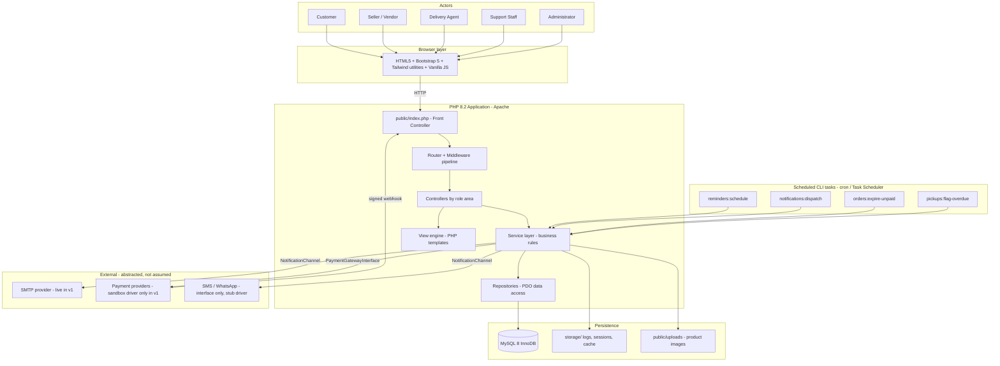
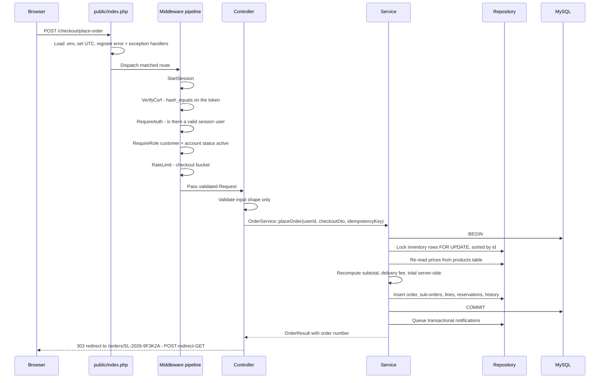
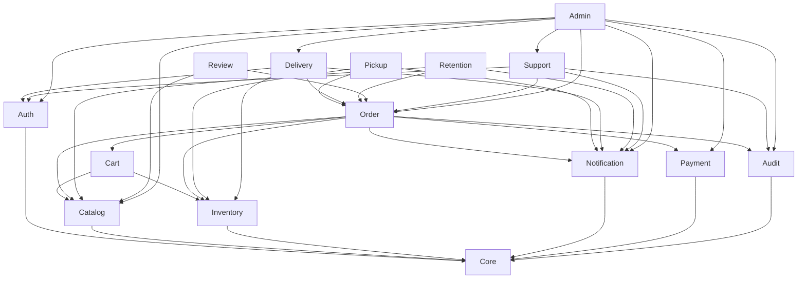
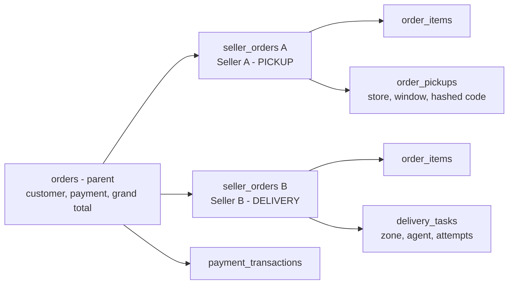
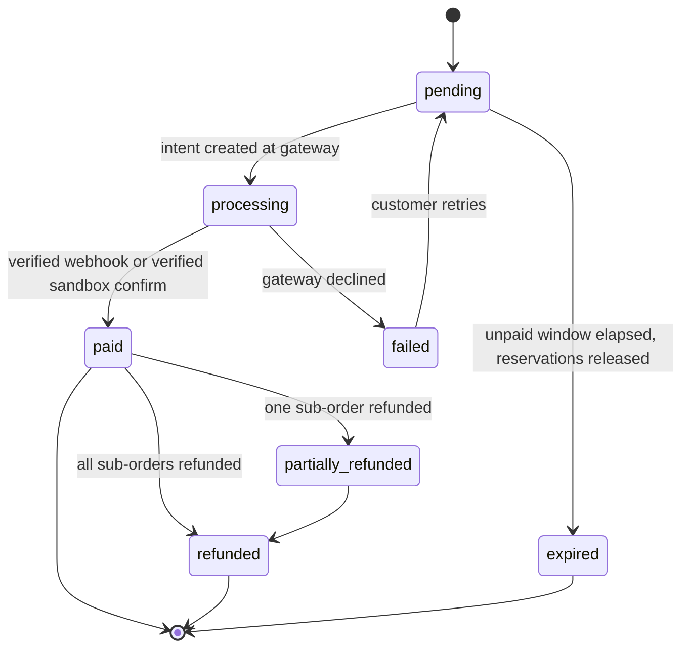
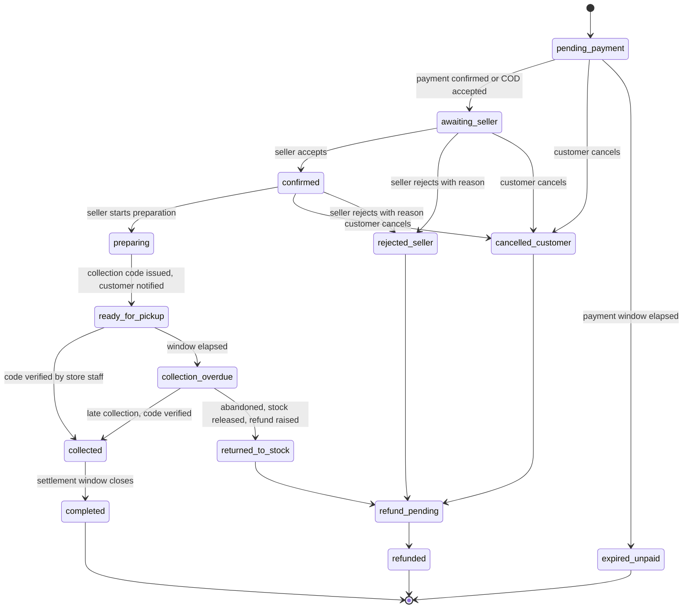
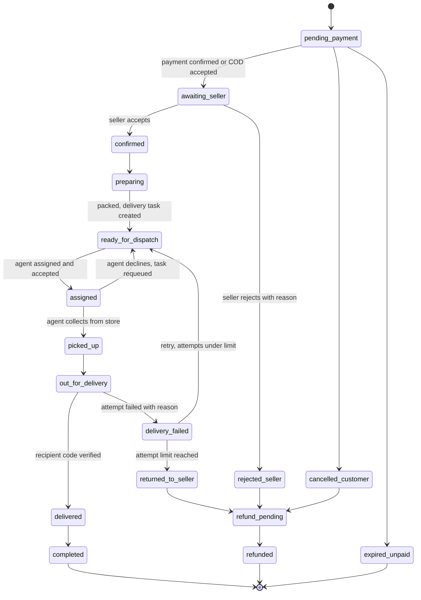

# System Architecture

**Status:** Phase 0 draft, awaiting approval
**Last updated:** 2026-09-21

This document defines how the application is structured, why it is structured that way, and how the
pieces depend on each other. It is written to be readable by someone who has not built a PHP
application before — each architectural decision is followed by a plain-language justification.

---

## 1. Architectural style

**A modular, layered, front-controlled PHP application.**

There is no framework. Instead we build the small number of framework-like pieces we actually need
(routing, request, view rendering, middleware, validation, database access) and keep them in
`app/Core`. Everything else is ordinary application code organised by responsibility.

The layers, top to bottom:

```
HTTP request
    |
    v
public/index.php          Front controller: one entry point for every web request
    |
    v
Core\Router               Matches method + path, resolves a controller action
    |
    v
Middleware pipeline       Session start, CSRF, auth, role, account status, rate limit
    |
    v
Controllers               Parse input, call services, choose a view or redirect. No SQL, no business rules
    |
    v
Services                  All business rules: pricing, state machines, reservations, scheduling
    |
    v
Repositories              All SQL. Prepared statements only. Return arrays or entities
    |
    v
Core\Database             One PDO connection, UTC session, exception error mode
    |
    v
MySQL
```

**Why layered?** Each layer has exactly one reason to change. If the pickup rules change, only a
service changes. If a table gains a column, only a repository changes. If the page design changes,
only a view changes. That is what makes the system maintainable rather than a pile of PHP files that
each do a bit of everything.

**The rule that keeps it honest:** a controller never writes SQL, a view never calls a repository,
and a service never emits HTML. Violations are treated as defects, not style preferences.

---

## 2. System context diagram



Two things to notice:

1. **Scheduled work does not go through the browser.** The CLI tasks call the same service layer the
   web requests do. A reminder fires because cron ran, not because somebody had a tab open.
2. **External systems sit behind interfaces.** Swapping the sandbox payment driver for a real M-Pesa
   driver later touches one class and one config value, not the order code.

---

## 3. Request lifecycle



`Validate input shape only` in the controller means: is this an integer, is this present, is this a
known enum value. Whether the customer is *allowed* to do it, and whether the numbers are *correct*,
are service-layer questions, because those are business rules.

---

## 4. Proposed folder structure

```
C:\xampp\htdocs\e-commerce\
|
+-- public/                        <-- the ONLY web-reachable directory
|   +-- index.php                  Front controller
|   +-- .htaccess                  Rewrite all to index.php, security headers
|   +-- assets/
|   |   +-- css/  app.css, tailwind.build.css, design-tokens.css
|   |   +-- js/   app.js, cart.js, checkout.js, dashboard.js, scanner.js
|   |   +-- img/  logo, placeholders
|   |   +-- fonts/
|   +-- uploads/
|       +-- products/              Randomly named, re-encoded images
|       +-- .htaccess              php_flag engine off - deny execution
|
+-- app/
|   +-- Core/                      The small framework we own
|   |   Application.php  Router.php  Route.php  Request.php  Response.php
|   |   Redirect.php  View.php  Session.php  Csrf.php  Database.php
|   |   Container.php  Config.php  Env.php  Logger.php  Validator.php
|   |   RateLimiter.php  Paginator.php  Money.php  Clock.php
|   |   Exceptions/  HttpException.php  ValidationException.php  DomainException.php
|   |
|   +-- Middleware/
|   |   StartSession.php  VerifyCsrf.php  RequireAuth.php  RequireGuest.php
|   |   RequireRole.php  RequireAccountStatus.php  RateLimit.php
|   |   SecurityHeaders.php  AuditContext.php
|   |
|   +-- Controllers/
|   |   +-- Web/        Home, Catalog, Product, Store, Search, Cart, Checkout, Page
|   |   +-- Auth/       Register, Login, Logout, PasswordReset, EmailVerification
|   |   +-- Customer/   Dashboard, Profile, Address, Order, Reorder, Payment,
|   |   |               Notification, Preference, Review, Ticket
|   |   +-- Seller/     Dashboard, Store, Product, ProductImage, Inventory,
|   |   |               Order, Pickup, Dispatch, Report, Review, Settings
|   |   +-- Delivery/   Dashboard, Task, Status, History
|   |   +-- Support/    Dashboard, Ticket, OrderLookup, NotificationMonitor, Escalation
|   |   +-- Admin/      Dashboard, User, SellerApproval, Store, Category, Product,
|   |   |               Order, Delivery, Payment, Dispute, NotificationSetting,
|   |   |               Report, AuditLog, Setting
|   |   +-- Api/        CartApi, SearchApi, InventoryApi   (JSON, same-origin, CSRF-guarded)
|   |   +-- Webhook/    PaymentWebhookController           (signature-verified, CSRF-exempt)
|   |
|   +-- Services/
|   |   +-- Auth/          AuthService, RegistrationService, PasswordResetService,
|   |   |                  SessionGuard, PermissionService
|   |   +-- Catalog/       ProductService, CategoryService, SearchService, ImageService
|   |   +-- Inventory/     InventoryService, ReservationService, StockMovementRecorder
|   |   +-- Cart/          CartService, CartPricingService, CartMerger
|   |   +-- Order/         OrderService, OrderStateMachine, OrderNumberGenerator,
|   |   |                  CancellationService, RefundService
|   |   +-- Pickup/        PickupService, CollectionCodeService
|   |   +-- Delivery/      DeliveryService, DeliveryStateMachine, AssignmentService,
|   |   |                  DeliveryFeeCalculator, ZoneResolver
|   |   +-- Payment/       PaymentService, PaymentGatewayInterface,
|   |   |                  Gateways/SandboxGateway.php, Gateways/CashOnFulfilmentGateway.php,
|   |   |                  Gateways/README-adding-a-provider.md, WebhookVerifier, IdempotencyGuard
|   |   +-- Notification/  NotificationService, NotificationQueue, TemplateRenderer,
|   |   |                  ConsentService, UnsubscribeTokenService,
|   |   |                  Channels/ChannelInterface.php, Channels/EmailChannel.php,
|   |   |                  Channels/SmsChannel.php (stub), Channels/WhatsAppChannel.php (stub)
|   |   +-- Retention/     ReorderService, ReminderEligibilityEvaluator,
|   |   |                  ConsumptionEstimator, ReminderScheduler
|   |   +-- Support/       TicketService, TicketMessageService, EscalationService
|   |   +-- Review/        ReviewService, RatingAggregator
|   |   +-- Admin/         SellerApprovalService, ModerationService, SettingsService,
|   |   |                  ReportService
|   |   +-- Audit/         AuditLogger
|   |
|   +-- Repositories/      One per aggregate. UserRepository, ProductRepository,
|   |                      InventoryRepository, CartRepository, OrderRepository,
|   |                      DeliveryRepository, PaymentRepository, NotificationRepository,
|   |                      ReminderRepository, TicketRepository, AuditRepository, ...
|   |
|   +-- Domain/            Enums and value objects mirrored from DB enums:
|   |                      OrderStatus, PaymentStatus, DeliveryStatus, TicketStatus,
|   |                      FulfilmentMethod, UserRole, AccountStatus, NotificationCategory
|   |
|   +-- Validation/        Rules/ and per-form request validators
|   |
|   +-- Views/
|       +-- layouts/       public.php (cinematic), dashboard.php (transactional), auth.php, email.php
|       +-- partials/      nav-public, nav-dashboard, sidebar-{role}, footer, flash, pagination, breadcrumbs
|       +-- components/    product-card, order-card, status-badge, stat-tile, empty-state,
|       |                  loading-skeleton, form-field, modal-confirm, star-rating
|       +-- pages/         Mirrors the controller tree: web/, auth/, customer/, seller/,
|       |                  delivery/, support/, admin/
|       +-- emails/        order-confirmed, ready-for-pickup, out-for-delivery, delivered,
|                          reorder-reminder, password-reset, seller-approved
|
+-- bin/
|   +-- console.php                Single CLI entry point: php bin/console.php <task>
|   +-- tasks/
|       ReminderScheduleTask.php   Finds eligible reorder reminders and queues them
|       NotificationDispatchTask.php  Sends queued notifications with retry/backoff
|       ExpireUnpaidOrdersTask.php  Releases reservations for abandoned orders
|       FlagOverduePickupsTask.php  Marks uncollected orders and notifies
|       PruneTokensTask.php         Deletes expired reset / verification tokens
|
+-- database/
|   schema.sql        seed.sql       README.md
|   +-- migrations/   0001_init.sql, 0002_....sql  (forward-only, numbered)
|
+-- storage/                      Never web-reachable
|   +-- logs/  app.log, security.log, notifications.log, cli.log
|   +-- sessions/                 Custom session save path, restrictive permissions
|   +-- cache/
|
+-- tests/
|   +-- Unit/         Pricing, state machines, consumption estimator, validators
|   +-- Integration/  Repositories and services against a test database
|   +-- Security/     CSRF, IDOR, upload, auth-bypass probes
|   +-- Concurrency/  Parallel checkout oversell test
|   +-- Manual/       Scripted manual test checklists with recorded results
|
+-- docs/             (this folder)
+-- .env.example      .env is git-ignored and never committed
+-- .gitignore        composer.json      README.md
```

### 4.1 Why `public/` as the web root

Everything except `public/` becomes unreachable over HTTP. Your `.env`, your logs, your source code
and your SQL files cannot be downloaded even if PHP stops executing (a misconfiguration that has
leaked credentials from many real sites). See **OQ-05**: we will ship both an Apache vhost config for
the clean setup and a root `.htaccess` rewrite so `http://localhost/e-commerce/` works immediately on
a default XAMPP install.

---

## 5. Modules and responsibilities

| Module | Owns | Must not |
|---|---|---|
| **Core** | Routing, request/response, sessions, CSRF, PDO, config, logging, validation primitives, rate limiting | Contain any marketplace concept |
| **Auth** | Identity, credentials, sessions, tokens, role and permission checks | Know about orders or products |
| **Catalog** | Categories, products, images, search and filters | Know stock numbers or prices at checkout |
| **Inventory** | Per-store quantities, reservations, movements | Decide order status |
| **Cart** | Cart lines, merging, server-side pricing preview | Persist orders |
| **Order** | Order creation, the state machine, history, cancellation, refund initiation | Talk to a payment provider directly |
| **Pickup** | Store selection, readiness, collection codes, verification | Move stock itself (it asks Inventory) |
| **Delivery** | Zones, fees, tasks, assignment, statuses, failures | See other sellers' orders |
| **Payment** | Intents, transactions, webhooks, idempotency, refund records | Change order status directly; it raises events the Order module handles |
| **Notification** | Queue, channels, templates, consent, unsubscribe, delivery logs | Contain business rules about when to remind |
| **Retention** | Consumption estimation, eligibility, scheduling, reorder | Send messages itself (it asks Notification) |
| **Support** | Tickets, messages, escalation, scoped lookup | Read payment credentials |
| **Review** | Reviews, verified-purchase checks, aggregates | Publish without moderation state |
| **Admin** | Approvals, moderation, settings, reports | Bypass the audit log |
| **Audit** | Append-only record of privileged actions | Ever be updated or deleted from application code |

### 5.1 Module dependency graph



The graph is acyclic on purpose. **Payment does not depend on Order** — it records a verified
transaction and raises `PaymentConfirmed`, which Order consumes. Without that inversion, a webhook
would be able to reach into order state directly, and idempotency bugs become order-corruption bugs.

---

## 6. Order lifecycle

### 6.1 Two-level model



**Why split?** One customer pays once, but two sellers fulfil independently. If Seller B rejects the
order, Seller A's pickup must proceed unaffected, and only B's portion is refunded. A single flat
order table cannot express that without lying about status.

### 6.2 Payment status (parent order)



`pending_cod` is a variant of `pending` used for cash on fulfilment: it allows the sub-order to
proceed to fulfilment, and moves to `paid` only when the seller or agent confirms cash received.

### 6.3 Sub-order lifecycle — PICKUP



### 6.4 Sub-order lifecycle — DELIVERY



### 6.5 Who may trigger which transition

Enforced in `OrderStateMachine` and `DeliveryStateMachine`, server-side, before any write.

| Transition | Customer | Seller | Agent | Support | Admin |
|---|:--:|:--:|:--:|:--:|:--:|
| pending_payment to awaiting_seller | system | - | - | - | - |
| accept / reject | - | yes | - | - | yes |
| confirmed to preparing | - | yes | - | - | - |
| preparing to ready_for_pickup | - | yes | - | - | - |
| ready_for_pickup to collected | - | yes (code) | - | - | yes (override, audited) |
| preparing to ready_for_dispatch | - | yes | - | - | - |
| assign agent | - | - | - | - | yes |
| accept / decline task | - | - | yes | - | - |
| picked_up, out_for_delivery | - | - | yes | - | - |
| out_for_delivery to delivered | - | - | yes (code) | - | yes (override, audited) |
| report delivery failure | - | - | yes | - | yes |
| cancel (early states only) | yes | - | - | yes (on behalf, audited) | yes |
| refund | - | - | - | request only | yes |

Every "yes" is additionally subject to ownership: a seller must own the sub-order, an agent must be
the assignee. Role alone is never sufficient.

---

## 7. Cross-cutting design decisions

### D-01 Preventing oversold inventory

Reservation happens inside one transaction with pessimistic row locking:

```
BEGIN;
SELECT qty_on_hand, qty_reserved FROM inventory
  WHERE product_id IN (...) AND store_id = ?
  ORDER BY product_id          -- deterministic order avoids deadlock
  FOR UPDATE;
-- verify each line: qty_on_hand - qty_reserved >= requested
UPDATE inventory SET qty_reserved = qty_reserved + ?
  WHERE id = ? AND (qty_on_hand - qty_reserved) >= ?;   -- guard in the WHERE
-- affected rows must be 1, else abort
INSERT INTO orders / seller_orders / order_items / stock_movements ...
COMMIT;
```

Three defences stacked: the `FOR UPDATE` lock, the quantity guard repeated in the `UPDATE ... WHERE`,
and a database `CHECK (qty_reserved <= qty_on_hand)`. In plain terms — two customers racing for the
last bottle of oil queue behind the same row lock; the second one's guarded update matches zero rows,
the transaction rolls back, and they see "only 0 left" instead of both being sold the same bottle.
`tests/Concurrency/` will prove this rather than assert it.

### D-02 Payment idempotency

A `payment_transactions` table has a `UNIQUE (gateway, gateway_reference)` key. Webhook handling:
verify signature, then `INSERT` the transaction. A duplicate key means we have already processed this
event, so we return `200 OK` and do nothing else. Only a genuinely new row raises `PaymentConfirmed`.
The uniqueness constraint, not application logic, is what makes replay safe.

### D-03 Consumption-aware reminders

The brief explicitly warns against assuming depletion from elapsed days alone. The estimator produces
a `next_due_at` from, in priority order:

1. **Observed personal interval** — the median gap between this customer's own repeat purchases of
   this product (needs at least 2 prior purchases). Strongest signal.
2. **Seller hint scaled by quantity** — `typical_consumption_days x (pack_size x quantity) / pack_size`.
3. **Category default** — only if an admin has set one.
4. **Nothing** — if none of the above exist, no reminder is scheduled. Silence beats guessing.

Then hard suppression rules run before anything is queued: marketing consent must be current; the
source order must be `completed`; the customer must not have repurchased the product since; the
product must still be purchasable; no reminder for this product within the cooldown; the customer
must be under their frequency cap; and quiet hours must be respected. A unique key on
`(customer_id, product_id, cycle_key)` makes a duplicate physically impossible even if the task runs
twice.

### D-04 Bootstrap + Tailwind coexistence

Bootstrap owns layout, grid, navbar, modal, dropdown, offcanvas, form controls, tables.
Tailwind is compiled with `prefix: 'tw-'` and `preflight: false`, and is used only for spacing,
one-off colour, and small utility work. `preflight: false` is the critical setting — Tailwind's CSS
reset would otherwise fight Bootstrap's Reboot and silently break component styling. Load order is
Bootstrap, then `design-tokens.css`, then Tailwind build, then `app.css`. The rule for developers:
never put `class="btn btn-primary tw-bg-black"` on one element; pick one system per component.

### D-05 Timezone

PHP runs `date_default_timezone_set('UTC')`, the PDO connection runs `SET time_zone = '+00:00'`, and
every `DATETIME` column is UTC. A single `Clock` + formatting helper converts to
`Africa/Dar_es_Salaam` at render time. This matters most for reminders: a "9am local" quiet-hours rule
computed against inconsistent timezones sends messages at 2am.

### D-06 Views and escaping

The view layer is plain PHP templates with a strict rule: `<?= e($value) ?>` everywhere, where `e()`
is the single escaping helper. Raw echo of a variable is a reviewable defect. Views receive a flat
array of already-prepared data, never a repository or a PDO handle.

### D-07 Error handling

`set_exception_handler` and `set_error_handler` convert everything into either an HTTP error page
(generic message, reference id) or a JSON error for API routes. The reference id is written to
`storage/logs/app.log` with the full trace. Users see "Something went wrong. Reference: A7F3C2."
Support can look it up; nobody sees a stack trace with a database path in it.

### D-08 Audit logging

`AuditLogger::record(actor, action, entityType, entityId, before, after, ip, userAgent)` writes to an
append-only table. Called from services, not controllers, so a privileged action is logged wherever it
is triggered from — web, CLI, or webhook. No application code path updates or deletes audit rows.

---

## 8. Security architecture summary

| Threat | Control | Where |
|---|---|---|
| SQL injection | PDO prepared statements only; `ATTR_EMULATE_PREPARES = false` | `Core\Database` + all repositories |
| XSS | Single `e()` escaping helper; CSP header; no `innerHTML` with server data | Views, `SecurityHeaders` |
| CSRF | Per-session synchroniser token on every state-changing form and JSON POST | `Middleware\VerifyCsrf` |
| Session hijack | `HttpOnly`, `SameSite=Lax`, `Secure` in prod, strict mode, custom save path, regeneration, idle + absolute timeout | `Core\Session`, `StartSession` |
| Broken access control | Middleware role gate **plus** per-resource ownership check in the service | `RequireRole` + `PermissionService` |
| Insecure upload | MIME sniff, extension allow-list, size cap, random name, GD re-encode, `php_flag engine off` in uploads | `ImageService` + `uploads/.htaccess` |
| Payment tampering | Server-side totals; signature-verified webhooks; unique gateway reference | `CartPricingService`, `WebhookVerifier` |
| Duplicate payment | DB unique constraint on `(gateway, gateway_reference)` | schema + `IdempotencyGuard` |
| Race on stock | `FOR UPDATE` + guarded update + CHECK constraint | `ReservationService` |
| Credential leakage | `.env` outside web root, git-ignored, `.env.example` only in git | Repo layout |
| Brute force | Per-account and per-IP throttling with progressive backoff | `Middleware\RateLimit` |
| Privilege escalation | Roles read from the database per request, never from a cookie, form field, or session-cached array that is not revalidated | `SessionGuard` |

---

## 9. Technology decisions and justification

| Decision | Choice | Reason |
|---|---|---|
| Framework | None; custom `app/Core` | Mandated. Keeps the codebase teachable, no framework upgrade treadmill |
| Autoloading | Composer PSR-4 (`App\` to `app/`) | Standard, zero runtime cost, no `require` spaghetti |
| Templating | Plain PHP with an escaping helper | No extra dependency; PHP is already a template engine |
| DB access | PDO + hand-written SQL in repositories | Explicit, indexable, reviewable; an ORM would hide the concurrency behaviour we depend on |
| Migrations | Numbered forward-only SQL files applied by a CLI task | Simple, reviewable, works with `mysql` CLI and phpMyAdmin |
| Email | PHPMailer via Composer (**OQ-08**) | Correct SMTP, TLS, encoding and attachments. Hand-rolling SMTP is the riskier path |
| Tests | PHPUnit for unit/integration; scripted PHP for concurrency and security probes | Real assertions, real exit codes, usable in CI |
| JS | Vanilla ES modules, no build step | Mandated; the interactions needed (cart, filters, scanner, async status) do not justify a framework |
| CSS | Bootstrap 5 + prefixed Tailwind build | Mandated; conflict strategy in D-04 |

**Total third-party runtime dependencies: one (PHPMailer).** Everything else is dev-only or
first-party.

---

## 10. Environments

| Concern | Local development | Production (documented, not deployed in v1) |
|---|---|---|
| Web root | `public/` via vhost, or root rewrite | `public/` via vhost only |
| `display_errors` | On | Off; log to file |
| Session cookie `Secure` | Off (plain HTTP localhost) | On, HTTPS enforced |
| Payment gateway | `sandbox` | Real driver, credentials in `.env` |
| Email | Mailpit / MailHog or a real SMTP test account | Real SMTP with SPF/DKIM |
| Seed data | `seed.sql` loaded, clearly labelled demo rows | Never loaded |
| Cron | Windows Task Scheduler running `php bin/console.php ...` | System cron, per-task logging |
| Debug toolbar / verbose logs | On | Off |

Configuration lives in `.env`; `Core\Config` reads it once and exposes typed getters. No secret is
ever written into a PHP file that is committed.

---

## 11. What could go wrong, and the plan

| Risk | Likelihood | Mitigation |
|---|---|---|
| Bootstrap/Tailwind visual conflicts | Medium | `prefix: tw-`, `preflight: false`, documented per-component ownership (D-04) |
| Scope is large for a no-framework build | High | Phased delivery with explicit stop points; Must/Should priorities in the requirements |
| Concurrency bug in reservations | Medium | Dedicated concurrency test before Phase 4 sign-off |
| Reminder engine feels spammy | Medium | Consent, cooldown, frequency cap, quiet hours, suppression rules, one-click unsubscribe |
| Windows/XAMPP path and permission quirks | Medium | Documented setup, no symlinks, forward slashes, `realpath` guards on uploads |
| No live payment provider | Certain | Sandbox driver labelled as such in UI and docs; integration guide written for later |
