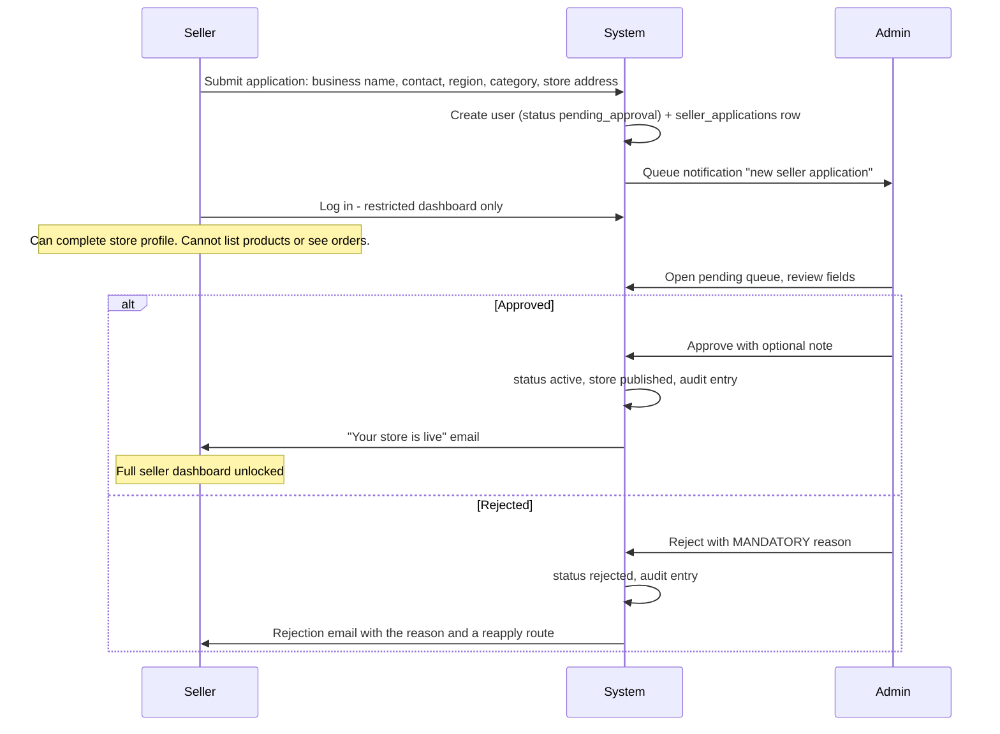
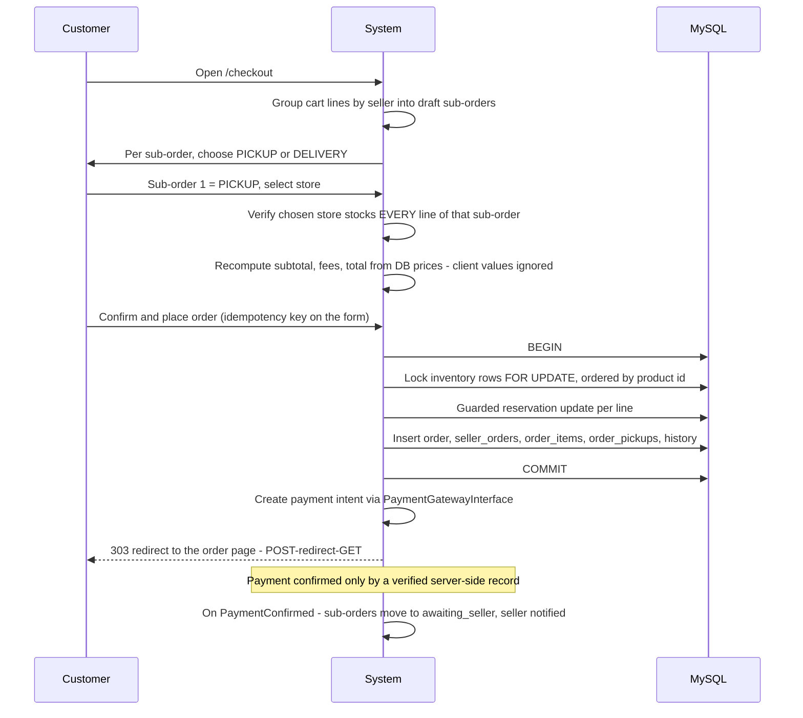
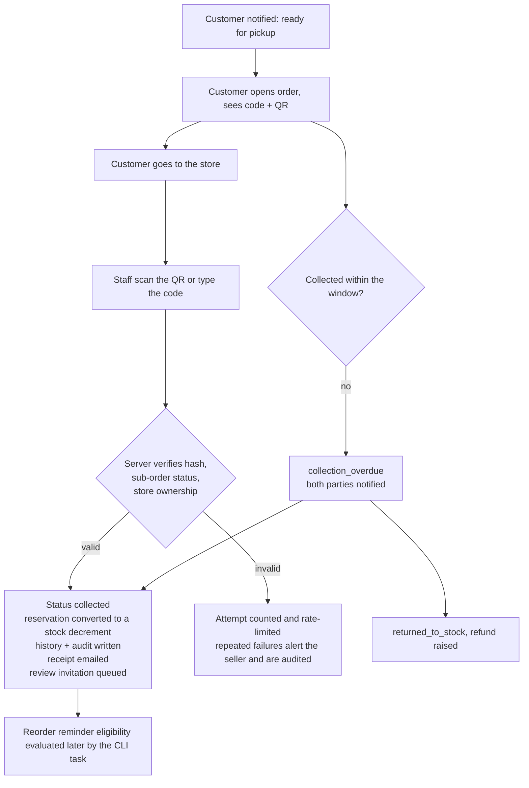
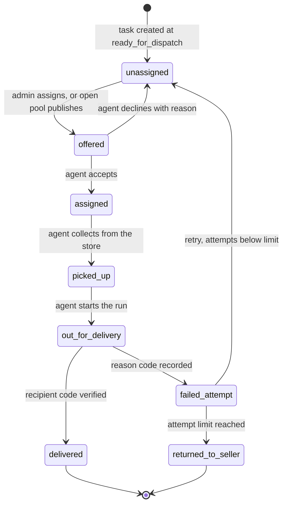
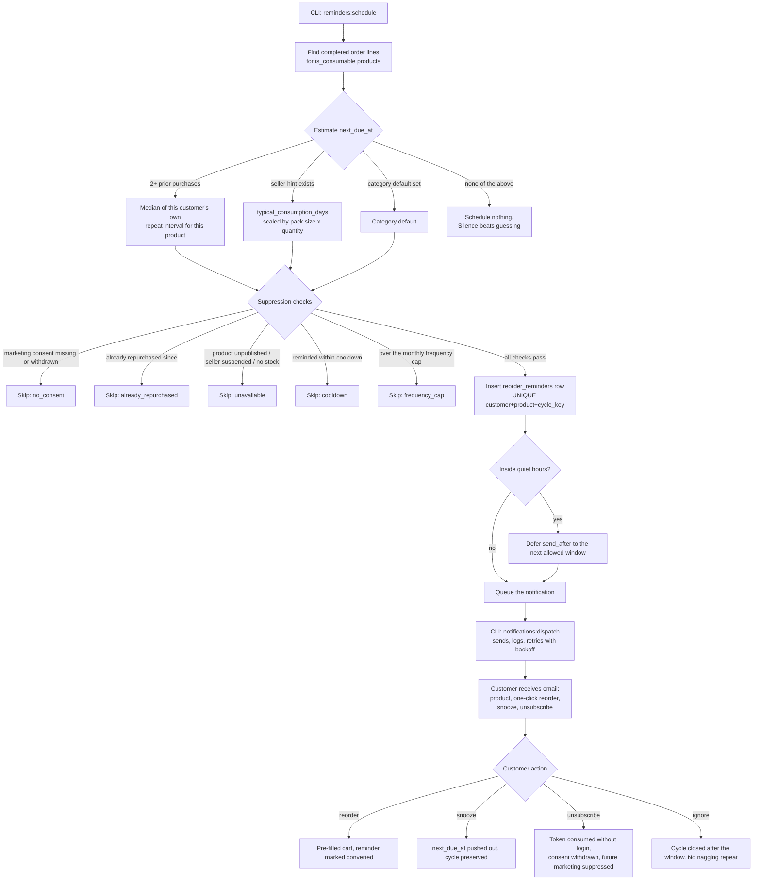

# User Flows

**Status:** Phase 0 draft, awaiting approval
**Last updated:** 2026-09-21

Each flow lists the happy path, the decision points, the failure branches, and the screens involved.
These flows are the source for the Phase 1 page list and the Phase 5 test cases — the workflow letters
(A–L) match the brief's Phase 4 workflow list.

Legend: **[C]** customer · **[S]** seller · **[D]** delivery agent · **[SUP]** support · **[A]** admin
· **[SYS]** the system acting on its own (request-time or CLI).

---

## Flow A — Customer registration and login  *(J1)*

**Screens:** `/register` · `/login` · `/verify-email` · `/forgot-password` · `/reset-password` · `/account`

1. **[C]** Opens `/register`, enters name, email, phone, password.
2. **[SYS]** Validates server-side: email format and uniqueness, password strength, phone `+255` shape,
   terms acceptance, marketing consent checkbox (**unticked by default** — consent must be an action).
3. **[SYS]** Hashes the password, creates the user with status `pending_verification`, assigns the
   `customer` role, queues a verification email, writes an audit row.
4. **[C]** Clicks the emailed link. **[SYS]** validates the single-use hashed token, sets status
   `active`, invalidates the token, regenerates the session id, logs the user in.
5. **[C]** Lands on `/account` with a first-run checklist: add an address, set notification preferences.

**Failure branches**

| Branch | Handling |
|---|---|
| Email already registered | Generic "if that address can be registered we have emailed you" + email to the existing account. Never confirms account existence |
| Token expired (24h) | Offer resend; old token stays dead |
| Wrong password | Generic message; failure counter per account **and** per IP |
| 5 failures | Progressive lockout with a clear retry time; security log entry |
| Unverified user tries to checkout | Blocked at the service layer with a resend-verification prompt |
| Password reset | Single-use hashed token, 60 min TTL, invalidated on use, **all other sessions destroyed**, confirmation email sent |

---

## Flow B — Seller registration and admin approval  *(J2, Workflow B)*

**Screens:** `/sell-with-us` · `/register/seller` · seller `/dashboard` (restricted) · admin `/admin/sellers/pending`

**Rules:** a `pending_approval` seller is blocked at the **service layer**, not by hiding the menu.
Rejection reasons are mandatory because "your application was unsuccessful" with no reason generates
support tickets.

---

## Flow C — Seller adds a product and sets stock  *(Workflow C)*

**Screens:** `/seller/products` · `/seller/products/new` · `/seller/inventory`

1. **[S]** Fills the product form: name, category, description, price, unit, pack size, SKU, images,
   `is_consumable`, `typical_consumption_days`.
2. **[SYS]** Validates: price > 0 and within sane bounds, SKU unique per seller, category is a leaf,
   at least one image.
3. **[SYS]** For each image — checks real MIME by content sniffing (not the filename), enforces the
   extension allow-list and size cap, strips EXIF, re-encodes through GD, stores under a random name.
4. **[S]** Sets stock per store on `/seller/inventory`, with a reason for each adjustment.
5. **[SYS]** Writes `inventory` rows and an immutable `stock_movements` entry per change.
6. **[SYS]** Product becomes visible in the catalogue when status is `published` **and** at least one
   store has `qty_available > 0`.

**Failure branches:** oversized or disguised upload rejected with a specific message; duplicate SKU
rejected; stock set below currently reserved quantity rejected (you cannot un-sell what is already
promised); archiving a product with open orders is blocked with an explanation.

---

## Flow D — Search, browse, add to cart  *(Workflow D, J3)*

**Screens:** `/` · `/products` · `/category/{slug}` · `/products/{slug}` · `/store/{slug}` · `/cart`

1. **[C]** Searches or filters. **[SYS]** runs a FULLTEXT query with a LIKE fallback, applies filters
   (category, price band, seller, store, in-stock, fulfilment, rating), paginates server-side.
2. **[C]** Opens a product. **[SYS]** shows price, per-store availability, seller, rating, reviews and
   the fulfilment options actually available for that product.
3. **[C]** Chooses a store (pickup) or leaves it for checkout (delivery), sets quantity, adds to cart.
4. **[SYS]** Validates availability **at add time**, then again at checkout. Adding to cart reserves
   nothing (**A-10**) — a browsing cart must not freeze a shop's inventory.
5. **[SYS]** Guest cart is cookie-bound; on login it merges into the user cart, summing duplicate
   lines and re-capping each at current availability.

**States to design:** loading skeleton on filter change, empty search result with suggestions,
out-of-stock badge with a "notify me" opt-in, price-changed warning on the cart.

---

## Flow E — Checkout with store pickup  *(Workflow E)*

**Screens:** `/cart` · `/checkout` · `/checkout/payment` · `/orders/{number}`

**Failure branches**

| Branch | Handling |
|---|---|
| Price changed since add-to-cart | Order is **not** placed. Difference shown, explicit re-confirm required (**FR-CART-10**) |
| Stock gone during checkout | Whole transaction rolls back; the exact line is named; cart is updated |
| No single store stocks the full sub-order | Offer: split the sub-order, swap to delivery, or remove the line |
| Double submit / back-button replay | Idempotency key returns the original order instead of creating a second |
| Payment fails | Order stays `pending_payment`, reservation held until the expiry window, retry offered |
| Payment never happens | `orders:expire-unpaid` CLI task cancels it and releases the reservation |

---

## Flow F — Seller prepares and marks ready  *(Workflow F)*

**Screens:** `/seller/orders` · `/seller/orders/{id}` · `/seller/pickup`

1. **[S]** Sees the new sub-order in `awaiting_seller` with a pick list.
2. **[S]** Accepts → `confirmed`. Or rejects with a mandatory reason → stock released, refund raised,
   customer notified.
3. **[S]** Starts preparation → `preparing`.
4. **[S]** Marks ready → `ready_for_pickup`. **[SYS]** generates a collection code, stores **only its
   hash**, shows the plaintext to the customer once, and queues the "ready to collect" notification
   with the store address, hours and pickup instructions.

**Guards:** every transition is validated by `OrderStateMachine` against the current status **and**
seller ownership. A `POST` of `ready_for_pickup` on a `pending_payment` order is rejected server-side,
regardless of what the form contained.

---

## Flow G — Customer collects the order  *(Workflow G, J4)*

**Screens:** customer `/orders/{number}` (code + QR) · seller `/seller/pickup/verify`

The code is verified **server-side against a hash**. A screenshot of somebody else's QR is useless
without the sub-order also being in `ready_for_pickup` at that specific store.

---

## Flow H — Checkout with home delivery  *(Workflow H)*

**Screens:** `/checkout` (delivery step) · `/account/addresses` · `/orders/{number}`

1. **[C]** Picks a saved address or adds one: region, district, ward, street, landmark, phone,
   delivery instructions.
2. **[SYS]** Resolves the address to a **delivery zone**. No zone → delivery unavailable, with pickup
   offered as an alternative rather than a dead end.
3. **[SYS]** Calculates the fee server-side: zone base fee + weight band + subtotal rules, minus any
   free-delivery threshold (**FR-CART-08**). A fee posted by the browser is discarded.
4. **[SYS]** Reserves stock at the fulfilling store and creates the sub-order as in Flow E.
5. **[S]** Accepts → prepares → `ready_for_dispatch`, which creates a `delivery_tasks` row.

---

## Flow I — Delivery assignment and completion  *(Workflow I, J5, J6)*

**Screens:** admin `/admin/deliveries` · agent `/delivery` · `/delivery/tasks/{id}`

**Agent scoping (FR-DEL-04):** every agent query is `WHERE delivery_tasks.agent_id = :actor_id`.
An offer screen shows only zone, distance band and fee — never the customer's address — until the
task is accepted.

**Failure reason codes:** `recipient_absent`, `wrong_address`, `refused`, `unreachable_phone`,
`access_denied`, `unsafe_conditions`, `damaged_in_transit`, `other` (free text required).

**Completion:** the agent enters the recipient's delivery code, or, for COD, confirms cash collected —
which writes a payment transaction, not just a status change. An agent cannot mark `delivered` from
the UI without the code; an admin override is possible, is flagged as an override in history, and is
audited.

---

## Flow J — Order history and reorder  *(Workflow J, J7)*

**Screens:** `/account/orders` · `/account/orders/{number}` · `/account/reorder`

1. **[C]** Opens history, filters by status, date, seller or fulfilment method.
2. **[C]** Clicks **Reorder** on a past order or a single line.
3. **[SYS]** For each line, re-checks: product still published, seller active, store stocking it,
   current price, current availability.
4. **[SYS]** Builds a **reorder summary** before touching the cart:

   | Outcome | Shown as |
   |---|---|
   | Available at the same price | Added |
   | Available, price changed | Added, with old → new price displayed |
   | Partially available | Added at the available quantity, shortfall stated |
   | Unavailable / unpublished / seller suspended | Not added, reason given, similar items suggested |

5. **[C]** Confirms → cart is populated → normal checkout.

Nothing is silently substituted and no price change is quietly absorbed. The customer sees exactly
what changed before the cart is touched (**FR-CRM-11**).

---

## Flow K — Consumption-aware reorder reminder  *(Workflow K, J8)*

**Trigger:** `php bin/console.php reminders:schedule`, run by cron/Task Scheduler — never by a page
view (**NFR-OPS-01**).

**Every skip is recorded with its reason**, so "why didn't this customer get a reminder?" is an
answerable question in the admin UI rather than a mystery.

**Duplicate prevention is structural:** `UNIQUE (customer_id, product_id, cycle_key)`. Running the
task twice in a row produces zero extra rows — an acceptance test, not a promise.

---

## Flow L — Support ticket and escalation  *(J9)*

**Screens:** `/account/support` · `/support/tickets` · `/admin/disputes`

1. **[C]** Opens a ticket, optionally attached to an order, with a category and priority.
2. **[SYS]** Creates it `open`, notifies the support queue, writes an audit entry.
3. **[SUP]** Assigns it to themselves → `in_progress`. Viewing the customer's order writes an audit
   entry referencing the ticket (**FR-SUP-06**).
4. **[SUP]** Replies publicly, or adds an internal note that is **structurally unable to render** in
   the customer view — it is filtered in the repository query, not just hidden in the template.
5. **[SUP]** Resolves → `resolved` → auto-`closed` after N days, or escalates to an admin with a
   mandatory reason → appears in `/admin/disputes`.
6. **[A]** Resolves the dispute, which may trigger a refund, a seller warning, or an account action —
   each with its own audit entry.

---

## Flow M — Administrator monitoring  *(Workflow L, J10)*

**Screens:** `/admin` · `/admin/orders` · `/admin/deliveries` · `/admin/payments` · `/admin/reports` · `/admin/audit`

1. **[A]** Dashboard: today's orders, GMV, fulfilment mix, pending seller approvals, failed
   deliveries, failed notifications, open disputes, low-stock alerts.
2. **[A]** Drills into any monitor with filters; every list is server-paginated.
3. **[A]** Reports: sales by period/seller/category, pickup vs delivery split, reminder conversion
   rate, delivery failure reasons, notification delivery health.
4. **[A]** Audit log: filter by actor, action, entity, date range. Read-only, with no delete path in
   the application at all.

---

## Flow N — Marketing consent and opt-out  *(supports J8)*

1. **[C]** At registration, marketing consent is a **separate, unticked** checkbox. Transactional
   messages are not optional and are described as such.
2. **[C]** `/account/notifications` shows a per-category, per-channel grid (order updates, pickup and
   delivery alerts, reorder reminders, promotions) x (email, SMS*, WhatsApp*). Channels marked * are
   shown as **Coming soon — not connected**, never as working toggles.
3. **[SYS]** Every consent change writes a versioned record: who, when, from where, what changed.
4. **[C]** Any marketing email carries a one-click unsubscribe link with a signed token that works
   **without logging in** (**FR-CRM-07**).
5. **[SYS]** Withdrawal takes effect immediately: queued-but-unsent marketing messages for that
   customer are cancelled at dispatch time, not just excluded from future scheduling.

---

## Flow O — Payment webhook  *(cross-cutting, security-critical)*

```mermaid
sequenceDiagram
    participant P as Payment provider (sandbox in v1)
    participant W as Webhook endpoint
    participant SVC as PaymentService
    participant DB as MySQL
    participant ORD as OrderService

    P->>W: POST callback with signature header
    W->>SVC: Raw body + headers (CSRF middleware exempt, signature required)
    SVC->>SVC: Verify signature or shared secret. If invalid, reject with 401 and log
    SVC->>DB: INSERT payment_transactions (UNIQUE gateway + gateway_reference)
    alt Duplicate key
        DB-->>SVC: constraint violation
        SVC-->>P: 200 OK, already processed, no side effects
    else New transaction
        DB-->>SVC: inserted
        SVC->>SVC: Match to order, compare amount and currency exactly
        alt Mismatch
            SVC->>DB: Flag for manual review, notify admin
            SVC-->>P: 200 OK, recorded, not applied
        else Match
            SVC->>ORD: PaymentConfirmed
            ORD->>DB: order paid, sub-orders to awaiting_seller, history written
            ORD->>ORD: Queue seller + customer notifications
            SVC-->>P: 200 OK
        end
    end
```

The browser's return from a payment page **never** confirms anything (**FR-PAY-06**). It only shows
"we are confirming your payment" and polls the order status, which is driven solely by the verified
server-side record.

---

## 3. Screen inventory derived from these flows

Used directly as the Phase 1 build list.

**Public (cinematic track):** home · products · category · product detail · store profile · search
results · cart · checkout (3 steps) · order confirmation · login · register · register seller ·
forgot password · reset password · verify email · about · contact/support · terms · privacy ·
unsubscribe confirmation · 403 · 404 · 500 · maintenance

**Customer (transactional track):** overview · profile · addresses · active orders · order detail
with tracking · order history · reorder · payment history · notifications inbox · notification
preferences · my reviews · write review · support tickets · ticket thread

**Seller:** overview · store profile · store hours · products list · product form · images ·
inventory · incoming orders · order detail / preparation · pickup queue · pickup verification ·
dispatch queue · sales reports · reviews · reminder settings · store settings

**Delivery agent:** overview · available offers · assigned tasks · task detail · status update ·
delivery confirmation · failed-delivery report · history

**Support:** overview · ticket queue · ticket detail · customer order lookup · communication history ·
notification monitor · escalation form

**Admin:** overview · users · user detail · seller approvals · stores · categories · products /
moderation · orders monitor · order detail · deliveries monitor · delivery zones · payments monitor ·
refunds · disputes · notification settings · reminder settings · reports · audit log · system settings

**Total: ~85 distinct screens**, built from a small set of shared layouts, partials and components
rather than 85 hand-written pages.
